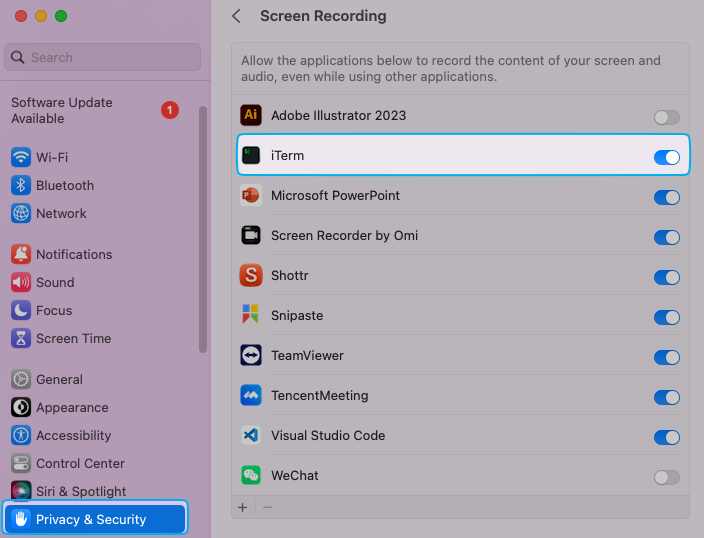

# 使用 pyautogui 图片识别时，为什么 VSCode 中运行时可以识别到图片但是终端工具 iTerm2 中却无法识别到

最近在开发一个自动加微的功能，使用了 pyautogui 来识别图片进行自动化任务。

在 VSCode 中测试都挺好的，但是单独使用命令行去调用就无法识别到，在终端工具 iTerm2 反复测试都找不到原因，百思不得其解。

## 找到问题

直到最后，想着是不是桌面显示不一样导致的，所以用脚本截取整个屏幕，才发现了区别，这里也提供下截取整个屏幕的代码：

```python
import pyautogui
screenshot = pyautogui.screenshot()
screenshot.save('iterm2_screenshot.png')
print("已保存截图，检查显示内容是否符合预期。")
```

一对比，还真发现了区别，VSCode 中截取的屏幕是有底部的菜单的，所以可以找到微信图标，但是 iTerm2 的截图中就是一个干净的桌面，啥也没有。

## 解决问题

一开始，我以为是 iTerm2 的设置问题，所以去网上搜了下，确实找到了相关的设置，有两个地方：

- General --> WIndows --> Native full screen windows
- Appearance --> General --> Auto-hide menu bar in non-native fullscreen

但是我两个选项都取消掉勾选了，截图发现还是没有菜单。

之后又是反复的测试，搜索，直到最后，才发现是因为 macOS 的安全与隐私设置导致的，它限制了 `pyautogui` 的访问权限。

所以只要调整下 macOS 的安全与隐私设置即可：

**解决步骤**：

1. 打开系统设置 > 隐私与安全性 > 屏幕录制。
2. 检查是否已授权当前使用的 Python 解释器或终端工具（如 iTerm2）。
3. 如果没有，请勾选 Python 或 iTerm2。
4. 重启应用以确保权限生效。


