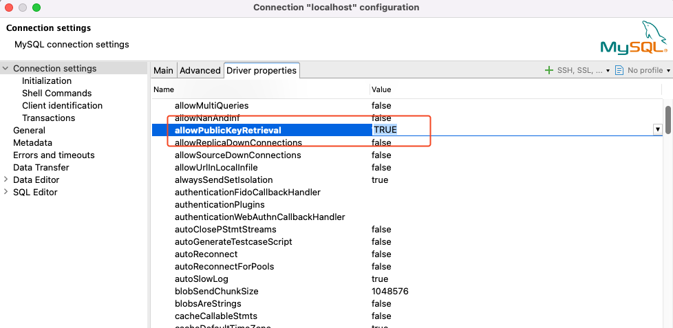

# Public Key Retrieval is not allowed 连接 MySQL 数据库报错

之前使用 DBeaver 连接本地数据库，刚开始数据库还没有密码，可以直接连接。

但是给 MySQL 设置用户密码后，连接就报错：`Public Key Retrieval is not allowed`

大概搜了下，解决办法很简单：

修改 `连接配置`，找到 `驱动属性`，修改 `allowPublicKeyRetrieval=true` 即可。

如果还不行，再修改下属性 `useSSL=false`。

