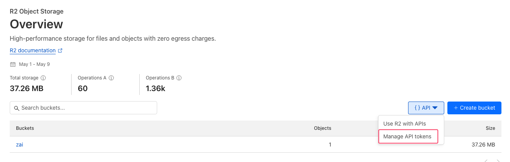
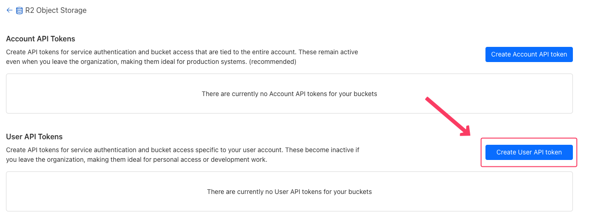
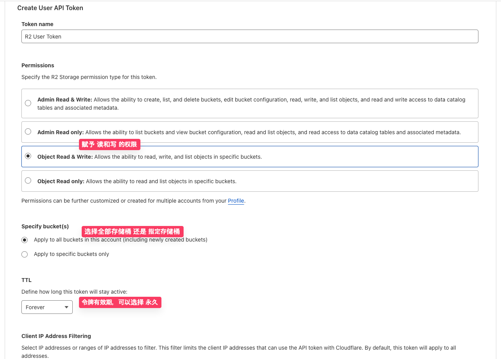
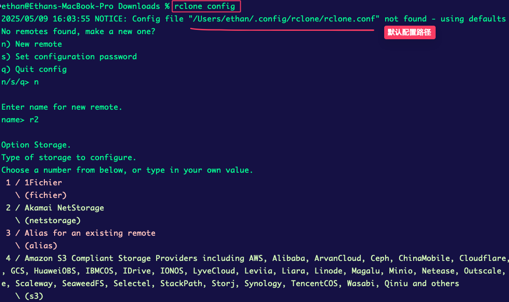
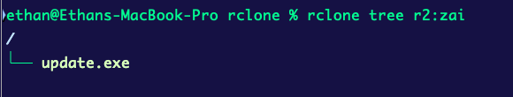

# 如何使用 S3 API 便捷管理 CloudFlare R2 对象存储的内容

现在更新内容喜欢直接在 [知识库](https://doc.shejibiji.com/) 更新，写成体系的文章也就少了。

这也和很多内容确实不大适合单独发一篇文章有关。

虽然之前也用过 **Cloudflare**，但最近因为公司有一个业务，需要把服务放到境外，于是重新尝试使用 **Cloudflare**，结果真的有点惊喜，对象存储服务下载的流量竟然不收费，这在国内通常是支出的大头，真的是爱了爱了。

废话少说，今天就来讲讲如何使用 S3 API 便捷管理 CloudFlareR2 对象存储的内容。

这里我们会用到 Rclone 这个工具，这是一款命令行式的云存储管理工具，支持几乎市面上所有流行的云储存产品。

（写这个文章几次被工作打断，无奈摊手...就简单整理下过程吧）

## 安装 Rclone

具体可以看知识库 [#Rclone](https://doc.shejibiji.com/notes/cli_tools.html#rclone) 的部分，这里不再赘述。

## 获取 CloudFlare R2 API

1.

首先打开 CloudFlare 管理后台，进入 **R2 对象存储** 菜单，

并找到 **管理 API Tokens** 的选项：



2.

选择创建 **新的用户 API Token**：



3.

填入 API Token 的名称，选择 **R2** 的权限，具体可以看图参考：



完成后，点击保存，就会获得以下信息，请保存后备用：

```bash
Access Key ID: XXX
Secret Access Key: XXX
endpoint: https://XXX.r2.cloudflarestorage.com
```

## 配置 Rclone

1.

在命令行中输入 `rclone config`，会进入交互式配置界面：



请按照以下步骤进行配置：

1. 输入 `n` 创建新的远程连接
2. 输入连接名称，随便起个名字就行，这里我们用 `r2` 作为连接名称
3. 选择 `s3` 作为存储类型
4. 选择 `Cloudflare` 作为提供商
5. 输入 `Access Key ID` 和 `Secret Access Key`，也就是我们刚才获取的 API Token
6. 输入 `endpoint`，这个在之前创建 API Token 的时候已经有了，格式为 `https://XXX.r2.cloudflarestorage.com`
7. 其他选项可以直接回车跳过，或者根据需要进行配置
8. 最后选择 `y` 保存配置
9. 输入 `q` 退出配置界面

完成以上步骤，就会生成配置文件 `~/.config/rclone/rclone.conf`（如果是 Windows 系统可能不同，可以参考知识库 [#Rclone](https://doc.shejibiji.com/notes/cli_tools.html#rclone) 的内容。

打开配置文件就可以看到你刚才填入的信息，类似下面这样：

```bash
[r2]
type = s3
provider = Cloudflare
access_key_id = XXX
secret_access_key = XXX
endpoint = https://XXX.r2.cloudflarestorage.com
```

现在输入 `rclone` 的命令就可以看到存储桶中的文件了。



## 更多 Rclone 命令

可以参考知识库 [#Rclone](https://doc.shejibiji.com/notes/cli_tools.html#rclone) 的内容。
