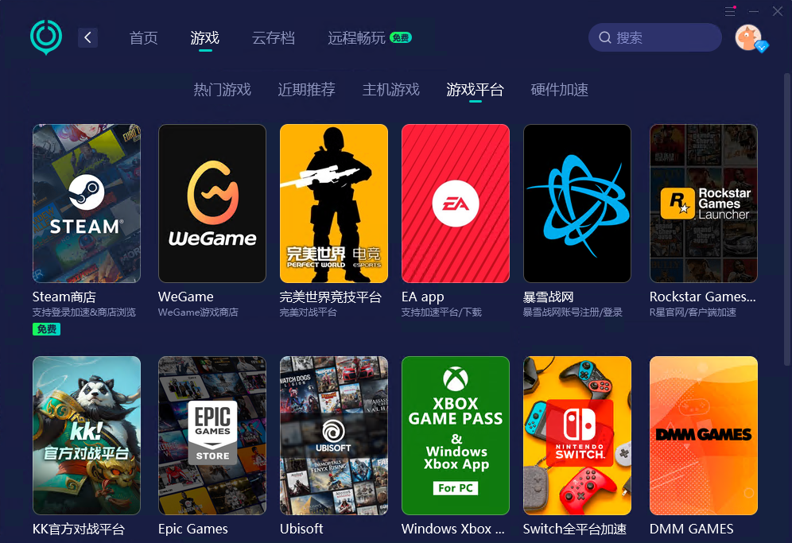

# 英雄联盟海外服还有多人在玩？加速器怎么选？UU 加速器 和 biubiu 加速器哪个好？

> 这篇文章只是我自己在玩英雄联盟海外服时，做的一些调查记录，所以也没什么逻辑，有兴趣的可以看看。

最近疯狂着迷《英雄联盟》，去网吧几百几百的充，每天玩到两三点，最后有点心疼钱，于是把公司电脑显卡升级了下，可以玩英雄联盟了。

但是不知道什么原因，国服就是打不开，被迫转到英雄联盟国际服了。

_你看，人就是这么务实，当一个地方某些事情不让做时，就会想着往另外一个地方跑了。_

## 海外服玩家数据

刚开始玩也没有多想，就注册了拳头账号，结果自动分配到了 Taiwan 服。

体验是真的不好，等级低的时候一起玩的全是人机，等级高了可以打匹配了，匹配时间是真的长，平均下来应该有 2-3 分钟。

后来查了下海外服的大概数据，可以在 [OP.GG](https://op.gg/zh-tw) 看到，发现台湾服的玩家是真的少，还是**韩服和东欧人多**呀。

（数据为英雄统计，也就是下面的规则，通过查看第一名英雄的游戏次数可以大概判断服务器每日游玩人数）

**具体统计数据（使用最多的上个月英雄场次）：**

| 英文名称             | 中文名称   | 英雄游戏场次（万次） |
| -------------------- | ---------- | -------------------- |
| **Korea**            | 韩国       | 104.5                |
| **Europe west**      | 西欧       | 76.3                 |
| Vietnam              | 越南服     | 35.8                 |
| **North america**    | 北美       | 32.8                 |
| Europe nordic & east | 北欧、东欧 | 32                   |
| Brazil               | 巴西       | 32                   |
| Lan                  | 拉丁美洲北 | 24.0                 |
| Türkiye              | 土耳其     | 18.78                |
| Las                  | 拉丁美洲南 | 17.4                 |
| Southeast Asia       | 东南亚     | 8.5                  |
| **Taiwan**           | 台湾       | 6.3                  |
| Russia               | 俄罗斯     | 5.19                 |
| Oceania              | 澳洲       | 4.2                  |
| Middle east          | 中东       | 1.8                  |

## 加速器对比

在海外服玩游戏，加速器是必须要开的，我刚开始就直接用的梯子，想着还能省个加速器的钱。

但梯子就是梯子，根本没有稳定性可言，导致的结果就是游戏频繁掉线，有时候连续掉线非常搞心态。

于是直接百度台服加速器，就遇到了 **biubiu 加速器**，说是阿里旗下的（这个真的值得骄傲吗？），可以免费用一天，就体验了下。

之后玩的台服，就再也没有掉线了，舒服的一批，可以说和国内体验一样了。

但匹配时间长依然是一个问题，于是想着都有加速器了，而且看上面还支持很多其它服务器，不如换个人多的区吧。

韩服和东欧人多，但韩服的账号似乎不好弄，因为要实名啥的，网上卖的也贵，就想着去欧服吧。经历了台服从 0 到 17 级的漫长岁月，这次想着直接买个号吧，搜了下价格是便宜，最后花了 26 买了个欧服的 22 级账号。

但当我打开加速器开始加速欧服时，才发现 ping 真的高，稳定在 140+，这个时候就想着换个加速器试试了。

以前就听过网易的 **UU 加速器**，想着应该还不错，就去官网上下载了个试试，也支持免费用一天，结果加速欧服 ping 一样是 140+，看来这是全球网络的问题，不是一个加速器能解决的了。

索性顺便把这两个加速器的信息都列出来给大伙看看，包括价格、界面和加速效果，有兴趣的可以对比看看。

#### biubiu 加速器

免费体验一天，单月 23，包年 239

英雄联盟美服 延迟：

英雄联盟欧服 延迟：

英雄联盟台服 延迟：

英雄联盟韩服 延迟：

#### UU 加速器

试用一天，包月 30，年付 283

另外还提供了一个全球会员，应该是给海外的人加速回国用的，价格也不便宜，能理解：

英雄联盟美服 延迟：

英雄联盟台服 延迟：

英雄联盟韩服 延迟：

支持的平台游戏还挺多：

## 总结

biubiu 加速器和 UU 加速器的延迟差不多，biubiu 加速器的界面更简洁，UU 加速器的界面更复杂一些。

biubiu 加速器可能名气没有 UU 加速器大，价格上面稍微有点优势。

如果是大众的加速需求，两个应该是不会有区别的，但小众的一点的游戏，我怀疑 UU 加速器可能支持的更好（纯猜的）。

\- End \-
