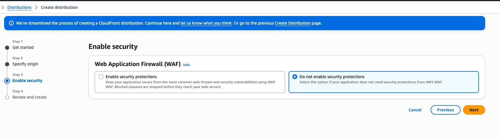

# 如何实现 Amazon S3 自定义域名 HTTPS 访问，利用 CloudFront 即可轻松实现云存储加速

> 最终图床实现效果可看：[laa.one](https://www.laa.one)

最近有空，查看了之前搭建的几个图床，发现 [laa.one](https://www.laa.one) 这个图床，现在使用本地存储，访问速度效果不理想，而且占用服务器空间，导致后期迁移很麻烦。

之前心疼 Amazon S3 的费用太贵，所以取消了该服务，现在决定做点好事，于是小手一点，又重新把 Amazon S3 给接入到 [laa.one](https://www.laa.one) 了。

但是之前采用的域名不支持 https 访问，而 [laa.one](https://www.laa.one) 是 https 应用，这会导致一个问题，**站内的图片预览都打不开了**。

幸好，最近公司让我用 Amazon 服务也有一段时间了，所以自然想到用 `CloudFront` 这个服务，也就是国内俗称的 CDN 服务，来实现 https 访问图片，而且还可以针对地区实现加速，就很实用。

但由于过程中还是难免遇到了一些问题，所以在此也记录下，希望对有需要的小伙伴有所帮助。

### 实现过程

1、

**创建新的 CloudFront 服务**

找到 CloudFront 界面，点击右上角黄色的按钮，创建一个新的 CDN 服务。

2、

**填写基础信息**

之后会让填写服务名称啥的，可以简单写一个。

点击下一步，会让指定 **源头**。

这里直接选择 `Amazon S3`

之后就可以通过 `Browse S3` 按钮，找到对应的 S3 存储桶，

其它设置可以不用修改，保持默认

3、

**安全应用选项**

之后进入网络应用防火墙选项，按照自己需求选择，我一看要钱，果断选择不用：

4、

**完成创建**

这一步就是展示下你之前设置的信息，直接点击右下角 `Create` 按钮，即可完成创建。

5、

**申请 SSL 证书**

创建后，就可以在服务列表中看到新建的这个 CDN 域名。

点击后进入，我们来设置定义域名。

进入详情后，点击 `添加域名`：

输入域名后，点击下一步，会自动配置对应的 SSL 证书。

点击申请证书，不要勾选 `Create a wildcard certificate`。

会提供对应的 DNS 配置信息，这个需要自己添加一个域名解析记录：

- **type**：CNAME

- **Name**：主机记录

  填入完整的值，类似 `_xxxxx.s3.shejibiji.com.`，除了最后的一个`.`不要，其它的都要，别自作聪明去掉域名的 HOST 部分（别问我为什么知道）。

- **Value**：值

  这个无需特别说明，最后的一个`.`不要

添加好后，等待验证。

验证很快，成功后即可自动获取到 SSL 证书并配置：

最后点击下一步即可完成。

6、

**解析域名到 CDN**

再进入详情就可以看到 `解析域名到 CloudFront` 选项，点击它：

会看到 DNS 的信息：

虽然这里显示记录类型为 `A`，

但是我们不要管，在域名解析里面填入要绑定的主机记录，类型选择 `CNAME` ，值使用这里提供的。

等待解析完成，就可以开始使用了。

7、

**推荐设置，关闭存储桶公共访问**

最后，为了安全起见，建议关闭存储桶的公共访问权限，并设置存储桶的访问权限为私有。

这样只有 CloudFront 能访问你的桶，防止绕过 CDN 直连。
