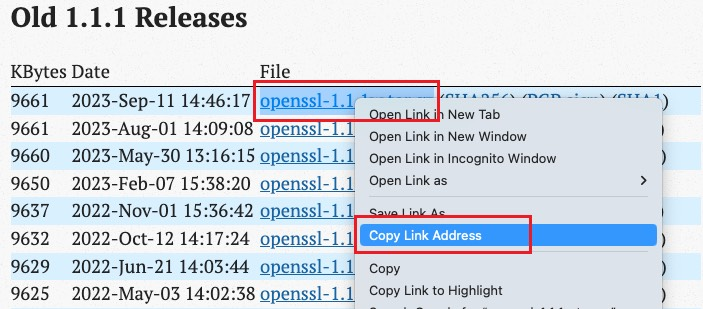
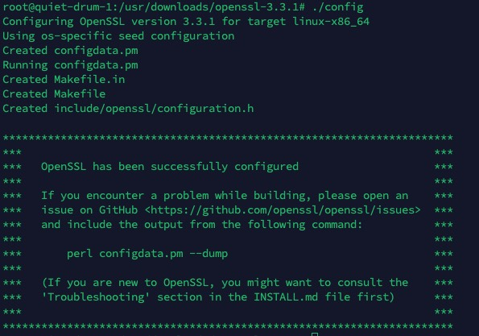
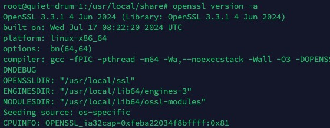

# 在 Linux 系统中手动编译安装升级最新 OpenSSL


今天在编译安装 Python3 后，在使用 pip 进行安装依赖时，总是报错，后面找到问题，是因为服务器上的 OpenSSL 版本为 1.1.0，不满足 python 编译的需求，导致这个模块没有成功被安装。

那么，就必须要求升级下服务器上的 OpenSSL 了。

OpenSSL 是一个开源的安全套接字层（SSL）密码库，它提供了广泛的加密算法和协议，用于在网络通信中保护数据。它包含了以下主要功能：

- **SSL/TLS 协议实现**：OpenSSL 实现了 SSL（安全套接字层）和 TLS（传输层安全）协议，这两种协议都被广泛用于在网络上加密数据传输。SSL/TLS 可以保护客户端和服务器之间的通信，防止数据被窃听或篡改。
- **对称加密算法**：OpenSSL 支持多种对称加密算法，例如 DES（数据加密标准）和 AES（高级加密标准）。这些算法用于加密和解密数据。
- **非对称加密算法**：OpenSSL 还支持多种非对称加密算法，例如 RSA 和 DSA。这些算法用于数字签名和密钥交换。
- **证书管理**：OpenSSL 可以用于生成、验证和管理数字证书。数字证书用于证明网站或用户的身份。

## 编译步骤

### 1. 删除之前旧的 openssl（可选）

```bash
apt remove openssl
```

### 2. 下载新版本的源码

官方下载源码：https://www.openssl.org/source/old/index.html

选择自己想要的版本，然后右键获取到下载地址：



在服务器使用下列命令下载源码：

```bash
wget https://www.openssl.org/source/old/1.1.1/openssl-1.1.1w.tar.gz
```

_如果下载的版本不同，后面的下载地址需要调整_

下载后，解压该文件：

```bash
tar -xzvf openssl-1.1.1w.tar.gz
```

并进入该文件夹：

```bash
cd openssl-1.1.1w
```

### 3. 编译安装 OpenSSL

1.

**首先需要配置**

执行下面配置的命令：

```bash
./config --prefix=/usr/local/ssl --openssldir=/usr/local/ssl shared zlib
```

- `--prefix=/usr/local/ssl`：指定安装目录

- `--openssldir=/usr/local/ssl`：指定配置文件目录

- `shared`：生成共享库

- `zlib`：支持压缩

你可以根据自己的需要更改配置，使用这个配置安装好后，执行文件为：`/usr/local/ssl/bin/openssl`

编译好的 SO 的文件会被安装到目录：`/usr/local/ssl/lib`



看到上图这个提示，就表示配置成功了。

2.

**然后编译**

分别执行下面的命令：

```bash
make
make install
```

这一步花费的时间比较长，耐心等待。

安装完成后，可以查看版本：

```bash
openssl version -a
```



如果到这一步，遇到问题，可以尝试在下面寻找答案。

## 常见问题

### openssl: command not found

可以先进入 openssl 的 bin 目录，直接执行程序来确认是否安装成功：

```bash
cd /usr/local/ssl/bin
./openssl
```

如果无法执行，表示安装失败，可以尝试重新安装。

如果可以执行，说明安装成功。命令没找到的原因，是因为环境变量中没有找到 openssl 的路径。

可以通过下面的命令添加一条链接：

```bash
ln -s /usr/local/ssl/bin/openssl /usr/bin/openssl
```

之后，再次执行 `openssl` 命令，就可以正常使用了。

### OPENSSL_1_1_1' not found

如果遇到下面这条报错信息：

```bash
openssl: /usr/lib/x86_64-linux-gnu/libssl.so.1.1: version OPENSSL_1_1_1' not found (required by openssl)
```

这是因为系统中 ldconfig 没有找到新的 openssl 库，需要手动添加，分别执行下面两条命令即可：

```bash
echo "/usr/local/ssl/lib" > /etc/ld.so.conf.d/openssl-1.1.1w.conf
ldconfig
```

- `echo "/usr/local/ssl/lib" > /etc/ld.so.conf.d/openssl-1.1.1w.conf`：将新的 openssl 库路径写入配置文件

- `ldconfig`：重新加载配置文件
