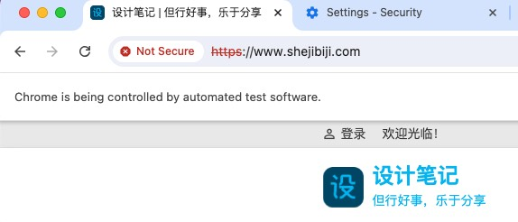
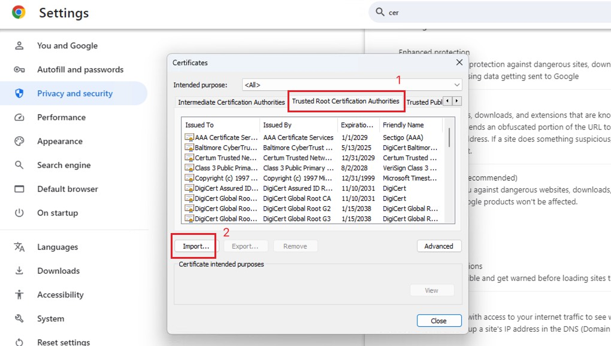
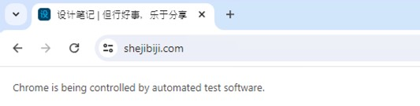

# 解决使用 Selenium-Wire 时，浏览器提示连接不安全

因为要使用到代理服务器，就从 Selenium 换到了 Selenium-Wire，但是浏览器中提示 https 连接不安全，虽然不影响使用及测试，但看着总是不舒服，就像下面这样：

解决办法其实很简单，只需要在浏览器上装上 Selenium-Wire 提供的代理证书即可。

## 解决方法

### 首先下载证书

两种方式：

1. 使用命令 `python -m seleniumwire extractcert`，就会自动下载证书文件到当前目录
2. 去这个地址下载： https://github.com/wkeeling/selenium-wire/raw/master/seleniumwire/ca.crt

下载后，就可以开始安装证书

### 安装证书

1.

**首先打开 Chrome 浏览器**

打开后，找到 Chrome 设置

2.

**搜索 Manage Certificates**

并打开这个设置项

3.

**选择 Trusted Root Certification Authorities**

这一步很重要，千万别忘记，如下图：

然后点击左下角的导入，选择刚才下载的证书文件即可。

## 完成

现在，再用 Selenium-Wire 打开网页，就可以看到 https 已经安全连接了，不会再有不安全提示了。

> 参考：https://github.com/wkeeling/selenium-wire/issues/120#issuecomment-877845102
