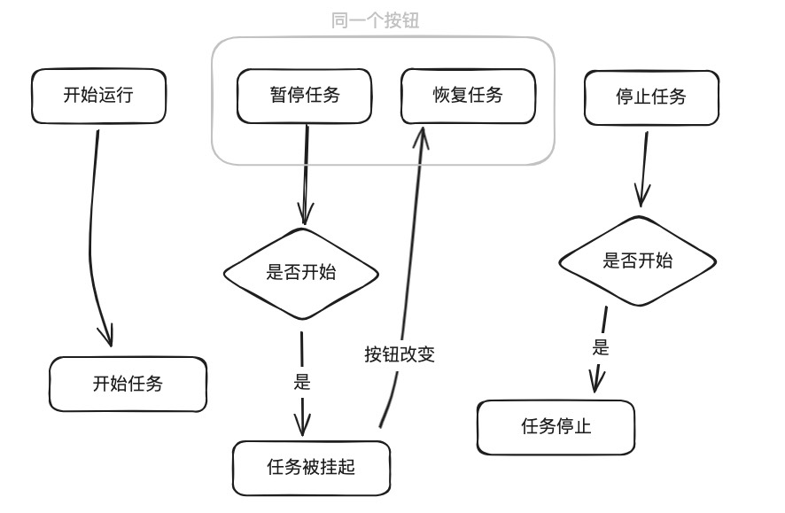

# 记一次 Python 应用开发频繁假死的问题

## 问题背景

最近在开发一款自动化的应用，其中有一个自动化任务会由下面这三个按钮控制：


逻辑也很简单，我大概画下图就是这样的：



但是，在测试时，却发现了问题：

当我点击暂停任务后，此时子线程被阻塞。如果我这个时候点击停止，那么就会任务结束。

之后，如果我再点击开始运行，整个应用就会卡死，非常离谱。

以下是简化后的代码：

```python
import threading
import time
from sample_singleton import singleton

@singleton
class TestThreadingEvent:
    def __init__(self):
        self._stop_event = threading.Event()
        self._pause_event = threading.Event()
        self._thread = None

    def set_stop(self):
        self._stop_event.set()

    def set_pause(self):
        self._pause_event.set()

    def start(self):
        print("任务开始")
        self._stop_event.clear()
        self._pause_event.set()
        print("开始执行")
        self._thread = threading.Thread(target=self._run)
        self._thread.start()

    def _run(self):
        count = 0
        while True:
            if self._stop_event.is_set():
                print("任务被成功停止")
                return
            print(f"是否需要暂停：{not self._pause_event.is_set()}")
            self._pause_event.wait()
            # 执行任务
            print(f"do something: {count}")
            time.sleep(1)
            count += 1

    def pause(self):
        print("点击了暂停")
        self._pause_event.clear()
        time.sleep(2)

    def stop(self):
        print("点击了停止")
        self._stop_event.set()
        print("成功停止")
        if self._thread is not None:
            self._thread.join()  # 确保线程终止


print("我点击了开始")
singletonA = TestThreadingEvent()
singletonA.start()
singletonA.pause()
print("我点击了停止")
singletonA.stop()
print("我再次点击了开始")
singletonA.start()
```

按照代码逻辑，我期待的结果是点击停止后，再次点击开始就可以开始重新运行，但是，虽然第一次显示停止了，可如果想再次开始，程序就会卡住不动了，下面为测试时输出的结果：

```python
我点击了开始
任务开始
开始执行
是否需要暂停：False
do something: 0
我点击了暂停
是否需要暂停：True
我点击了停止
成功停止
# 然后在这里卡死
```

昨天下午一直在代码中断点找原因，搞了半天，都没能解决，下班前我甚至都在怀疑是不是 Python 代码的问题，想去看看源码找原因了。

## 找出原因

不过简化代码，确实比较有效，当我把整个流程简化成上面的代码，就比较方便找出问题出在哪里了。

是因为，当我点击“暂停”后，子线程进入阻塞状态。当执行“停止”操作时，使用了 `self._thread.join()`，这会导致主线程阻塞，直到子线程 `self._thread` 完成。然而，如果子线程因阻塞状态无法完成，就会导致主线程永久等待，结果是主线程卡死。

后面我看了下我们实际开发的应用代码，问题要更复杂点，但说到底，都是线程阻塞状态没有得到正确处理，导致的卡死。

## 解决办法

由于主线程卡死是子线程的阻塞状态造成的，可以通过以下两种方法解决：

1. **处理子线程阻塞**：引入超时控制，确保子线程在合理时间内完成任务，并在必要时修改子线程的阻塞状态，以避免主线程长时间等待。
2. **销毁子线程**：如果子线程在完成任务后不再需要重复使用，可以考虑在结束时直接销毁该线程，以避免阻塞主线程。

这两种方法可以有效避免主线程因子线程阻塞而卡死的问题。
