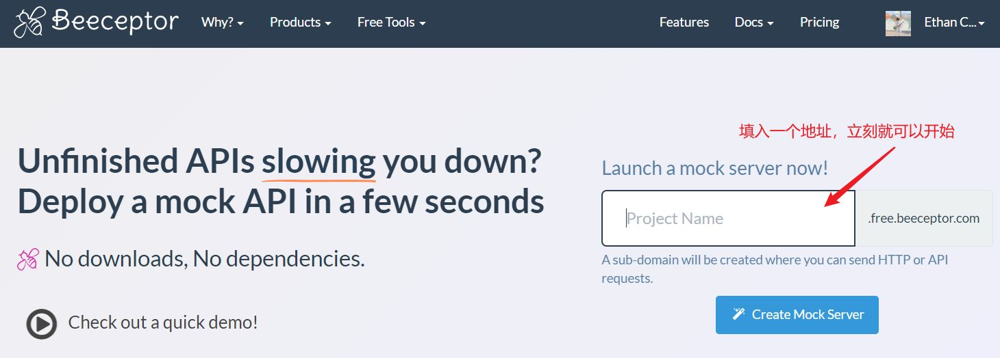
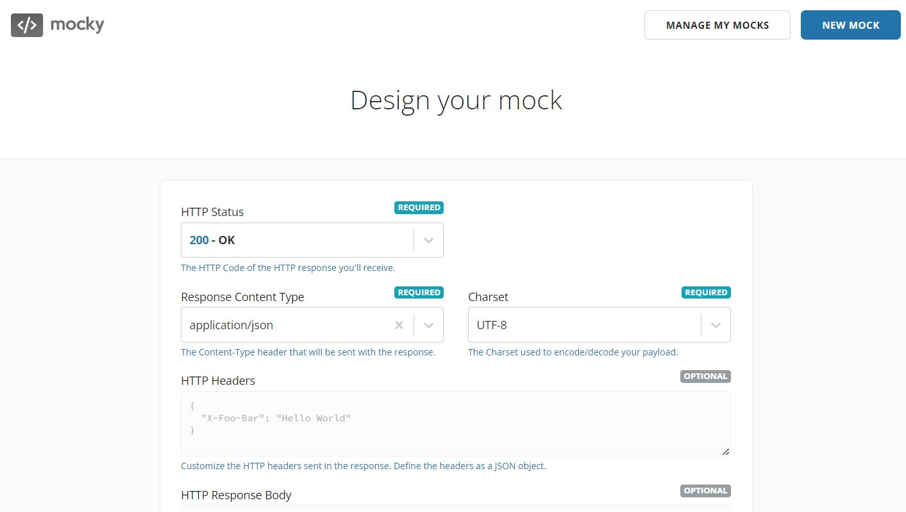
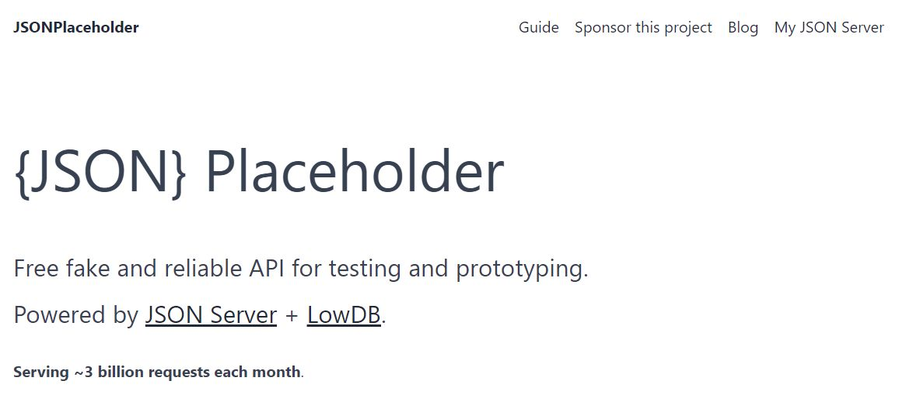

# 国外流行的免费模拟 API 接口工具，快速创建 Mock 接口数据

有时候我们希望临时使用一个模拟 API 接口，来帮助我们在开发中返回期待的格式数据。

所以我收集了一些常用的免费服务，可以非常方便地帮你创建假的 API Mock 数据，测试前端应用或其他客户端与服务器的交互。

以下是一些常用的工具列表：

### Beeceptor

**[Beeceptor](https://beeceptor.com/)** - 这个工具可以创建即时的接口来模拟 API，进行请求拦截和规则制定。它允许你定义请求应该返回的响应。

使用也是非常简单，打开首页就可以填入一个地址，立刻就会获得一个默认 API 接口服务。

当然你也可以进行更详细的配置。

### Postman Mock Servers

**Postman Mock Servers** - Postman 提供了一个强大的模拟服务器功能，可以用来创建和模拟 API 响应。你可以在 Postman 的环境中定义 API 请求和预期的响应数据。

具体使用可以参考：[官方文档](https://learning.postman.com/docs/designing-and-developing-your-api/mocking-data/setting-up-mock/)

### Mocky.io

**[Mocky.io](https://designer.mocky.io/)** - 这是一个简单的在线工具，可以快速生成模拟的 API 接口。只需定义响应体、状态码等，就能得到一个可以访问的 URL 来模拟你的 API。

打开首页也是立刻就可以开始设计自己的 Mock 数据接口，使用非常方便。

### JSONPlaceholder

**[JSONPlaceholder](https://my-json-server.typicode.com/)** - 这是一个免费的在线 REST API 服务，你可以用它来获取测试数据。它提供了标准的用户、帖子、评论等 API 接口，适用于测试和原型制作。

官方也是声称每个月会处理 30 亿个请求，还是非常值得一试的。

### Mockoon

**[Mockoon](https://mockoon.com/)** - 这是一个桌面应用程序，允许你在本机创建模拟的 REST API 服务器。它支持多个环境和路由，是进行本地开发和测试的好工具。

免费开源，无需登录的，可以放心使用。

### 总之

这些工具都有各自的特点，你可以根据具体的需求选择适合的服务来帮助你在开发过程中模拟 API 数据。
