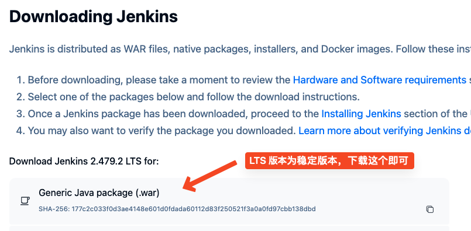
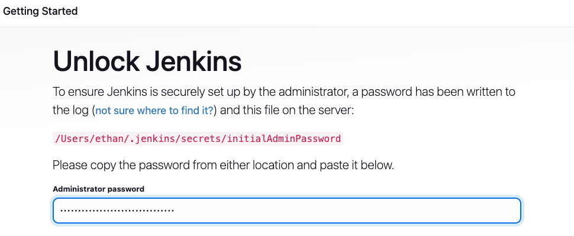
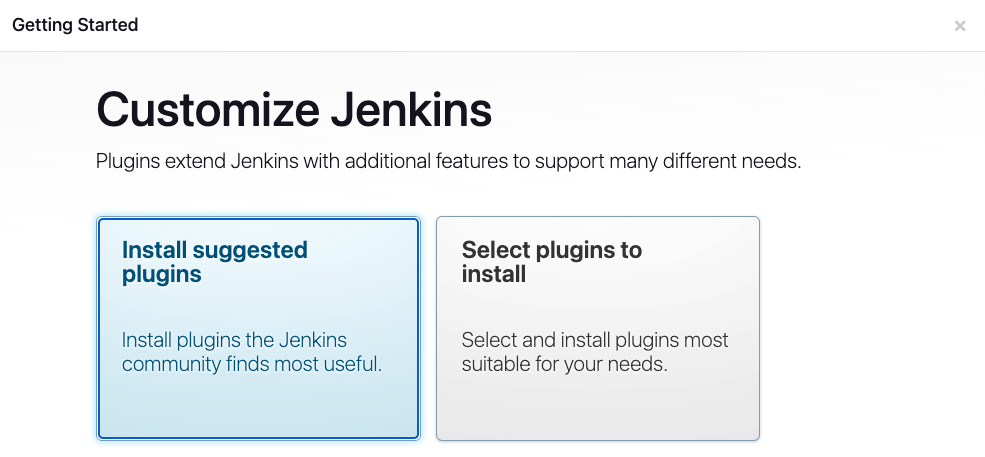
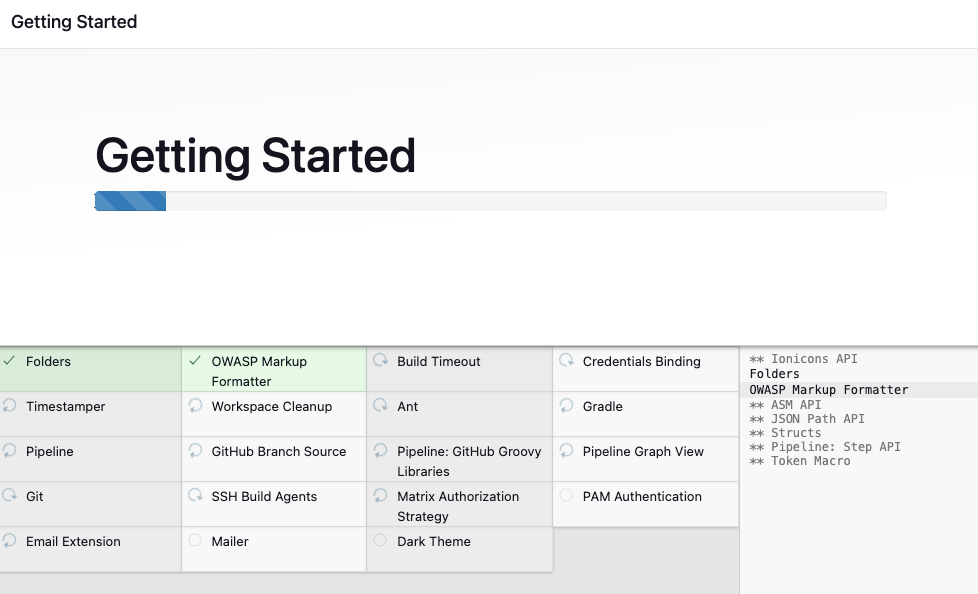
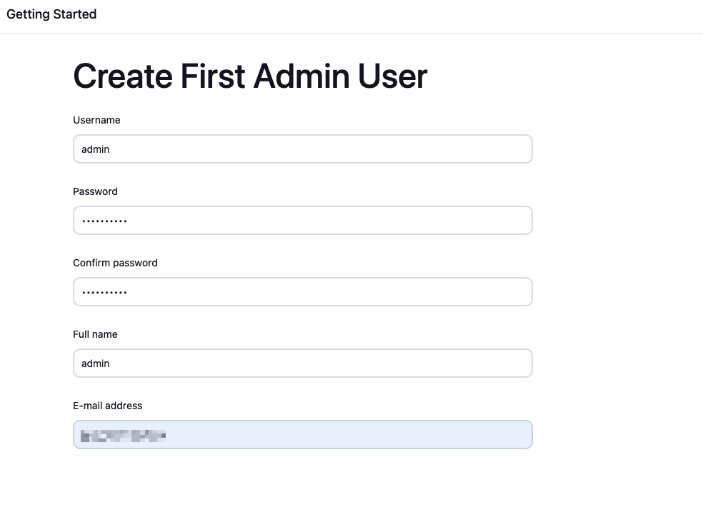
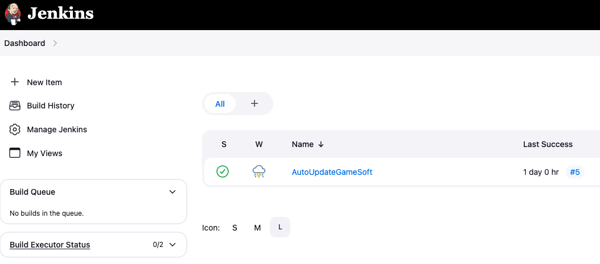
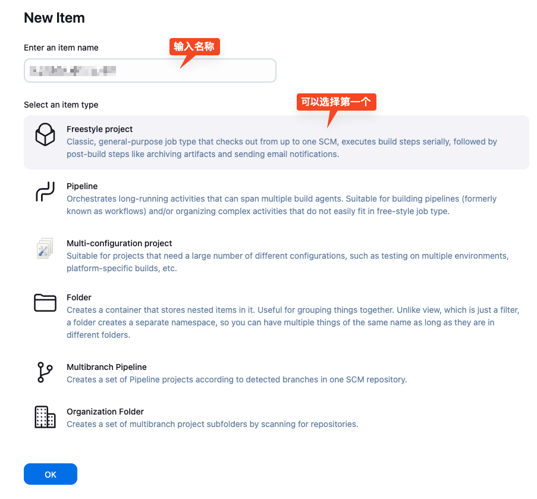
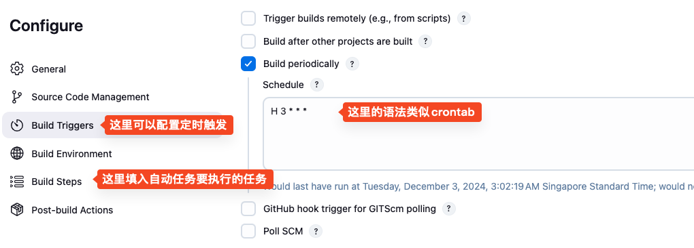

# 如何使用 Jenkins 来部署自动化任务


Jenkins 是一个流行的开源自动化服务器，主要用于实现 **持续集成 (Continuous Integration, CI)** 和 **持续交付 (Continuous Delivery, CD)**。它通过自动化软件开发的构建、测试和部署流程，大幅提高了开发效率和软件质量。

## 那么该如何开始使用呢

Jenkins 是基于 Java 的，请先确保已经安装了 Java，再继续之后的环节。

Java 的安装可以搜索另外的文章解决。

### 一、安装 Jenkins

Mac 和 Windows 上安装会有点区别，可以找到对应平台的安装包。

这里为了统一，都采用手动运行单文件的方式实现。

**首先需要去官网下载 WAR 文件**

下载地址：[https://www.jenkins.io/download/](https://www.jenkins.io/download/)

打开页面后，找到下面的下载列表，选择下载即可。



**下载后，就可以使用 Java 启动该应用**

使用下方的这个命令来启动 jenkins：

```bash
java -jar jenkins.war --enable-future-java
```

- `--enable-future-java` 可选参数，表示启用 Java 的未来版本，因为官方推荐使用 java 17/21，如果需要支持更高版本的 Java，可以使用这个参数。

等待启动完成后，就可以看到密码提示，这个密码是用来登录 Jenkins 的初始密码。

如果找不到密码了，可以在 `~/.jenkins/secrets/initialAdminPassword` 文件中找到。

_Windows 用户可以在 `C:\Users\<username>\.jenkins\secrets\initialAdminPassword` 中找到。_

**之后就可以访问 Jenkins 服务了**

Jenkins 默认端口是 8080，所以可以在浏览器中输入 `http://localhost:8080` 来访问。

### 二、配置 Jenkins

**首先要解锁 Jenkins**

打开服务后，需要输入密码，使用之前提到的密码进行登录：



**下一步安装插件**

可以选择默认插件，这个之后可以随时额外安装插件：



**等待插件安装完成**

如果有插件安装失败的话，点击重新安装即可。



**最后创建管理员用户**

这里面可以填入自定义的管理员账号和密码即可，方便之后登录使用：



**看到这个界面就表示配置完成啦！**


### 三、开始第一个任务

在 Jenkins 首页左侧菜单中，选择`New Item`



输入名称，选择 **“Freestyle project”** 或 **“Pipeline”**，然后点击 **“OK”**。



之后根据自己的项目，填写必要的触发条件及任务步骤即可：



有了任务后，你可以点击立刻执行，或者等待自动触发执行，并根据日志等信息，来查看每次执行的细节。

更多使用方法可以关注我文档中的更新：[Jenkins](http://doc.shejibiji.com/backend/java/java_jenkins.html)

\- END \-
