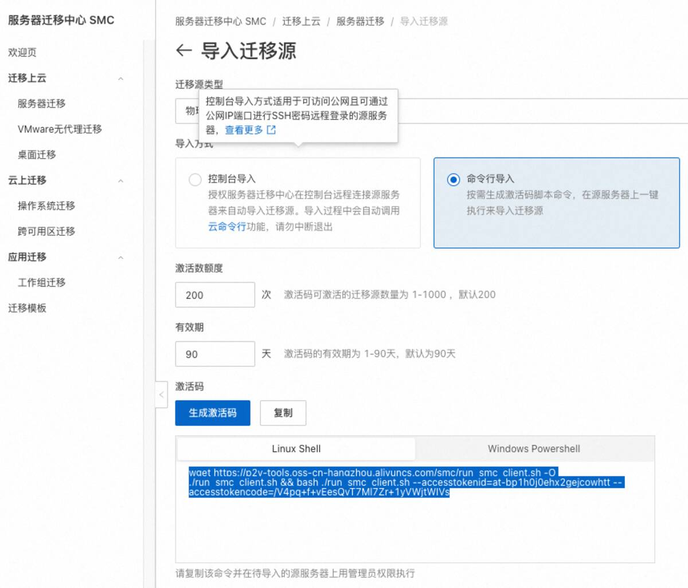
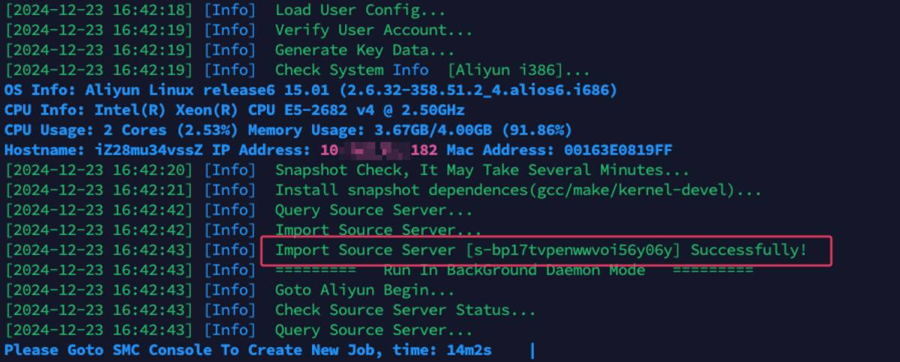
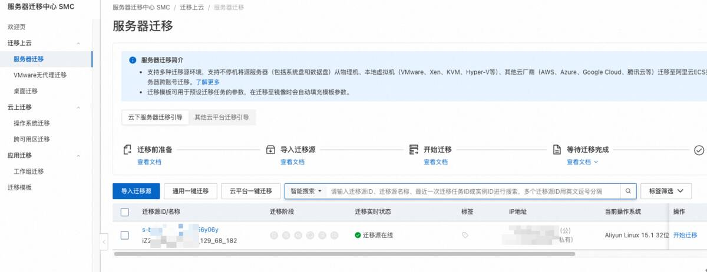
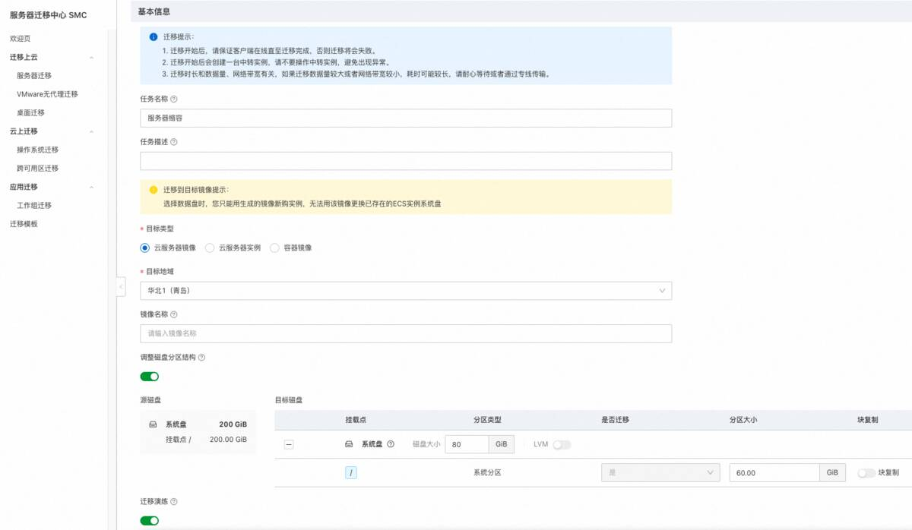
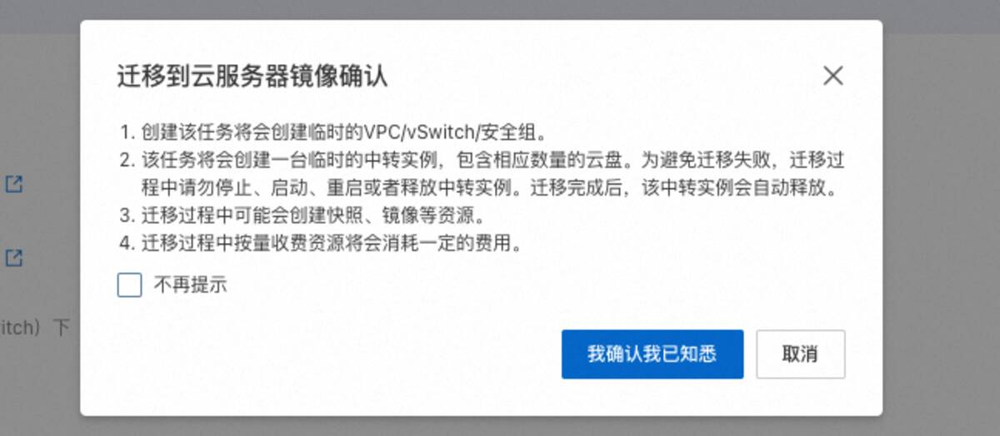
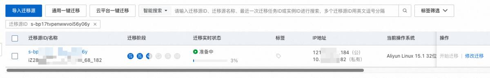
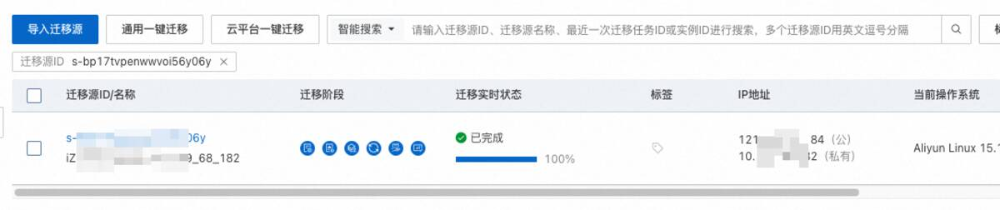
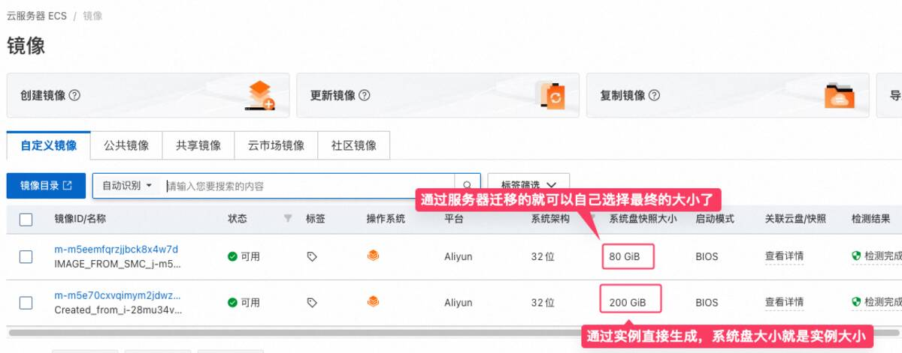
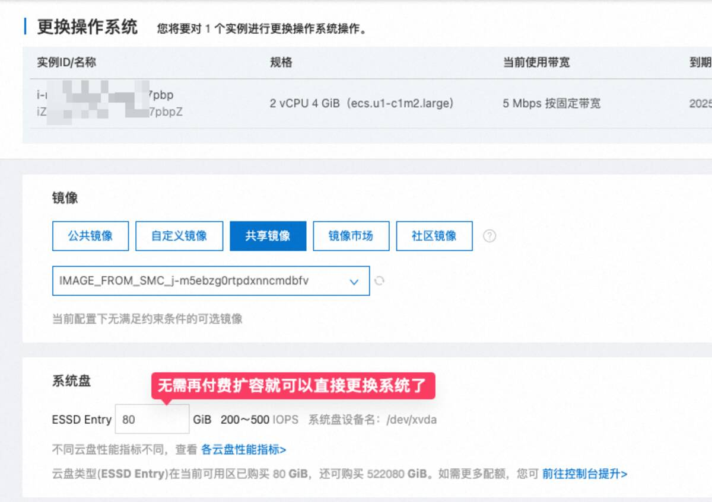

# 解决阿里云系统盘大小不同，无法直接使用镜像迁移的问题，阿里云服务器 SMC 迁移教程

下午正在悠哉的敲着代码时，领导突然过来说让我迁移个服务器。这个事情也不是第一次了，对我来说倒简单。

本来我还想趁这个机会，顺便升级下各种服务应用的版本或者重新更新下配置啥的。结果我登录服务器账号一看，好家伙，今天到期呀，离下班也就 3 个小时了，这是真的没打算给我留多做点事情的机会呀。

那没啥好说的，不折腾了，直接用阿里云镜像迁移吧，之前也写过教程，操作简单快速：[《阿里云如何迁移复制服务器，如何做网站数据迁移》](https://www.shejibiji.com/archives/9609)

## 新问题

但是这次直接用镜像迁移却出现了一点小问题。

因为我们这次直接购买了阿里云活动 `199元/年` 的服务器，系统盘只有 `80G`，而我们之前的服务器系统盘是 `200G` 的，所以直接使用镜像迁移是不行的。

在更换系统的时候，会让我们购买更大的系统盘，而且最小的系统盘也是 `200G`，这样就会导致我们的服务器成本增加。

而我想要的是: **在不扩大系统盘的情况下，实现服务器的完整迁移。**

一时也没有思路了，只能提交工单，来问问阿里云的技术支持了。

技术支持给了两种方案，其实本质都是一样，都是通过一个临时的中转服务器来实现，先把镜像放到中转服务器上，然后缩小中转服务器的系统盘，再生成新的镜像放到最终目标服务器上。

我选择了第二种方案，就是通过利用阿里云的 SMC 服务来实现服务器的迁移，这样就不需要考虑购买临时中转服务器的问题了。

技术给了一个教程链接，写的还是很详细的，可以看看：[《跨账号和同账号 ECS 实例间迁移》](https://help.aliyun.com/zh/smc/user-guide/migrate-servers-between-ecs-instances?spm=a2c4g.11186623.0.0.796f4c27p8ntac#646936329ecth)，特别是有关于**ECS 实例磁盘缩容**的内容，很有价值。

## 开始迁移

1.

**导入迁移源**

首先在**服务器迁移中心**中，选择服务器迁移，选择`导入迁移源`

我这里选择`命令行导入`，比较方便。

最后点击`生成激活码`来获得一条 Shell 命令，这条命令待会需要去旧的那台去执行：

2.

**服务器中执行命令**

执行刚刚复制的 Shell 命令，看到 `Successfully` 表示导入成功了。

**确认迁移源在线**

你可以在镜像源列表中查看状态，如果有`迁移源在线`表示成功：

3.

**开始迁移**

之后就可以在迁移源的右侧，点击开始迁移。

然后需要配置信息，注意这里目标类型选择`云服务器镜像`，另外系统盘的大小要改到我们新服务器的大小，系统分区是要求小于系统盘的，可以再稍微小一点：

信息填好后，点击确认，就可以等待自动任务执行了：

**注意**: 余额要求有 100 元，否则演练时就会失败

这一步时间还是比较久的，可以耐心等待下：

如果看到状态为`已完成`就比较已经准备好了。

4.

**共享镜像**

因为我们在之前的目标类型中选择的是: **云服务器镜像**

所以成功后会生成阿里云自定义镜像。

在镜像列表中，就可以看到刚刚生成的镜像，而且此时的镜像已经完全满足了我们对系统盘大小的要求:

我们再选择共享该镜像给另外一个账号。

5.

**更换系统选择新镜像安装**

现在就可以在另外一个账号直接选择安装这个共享镜像来实现服务器的迁移了。

此时也无需在付费扩容系统盘了，因为我们的镜像已经满足了我们的要求。

## 感慨

其实这个事情是在很多天前就做了，当时截了图，想着之后整理成笔记。

结果一直在忙别的事情，拖到了今天，才勉强整理了出来。

也不知道是职业的问题，还是现在自己状态的问题，总感觉没有太多时间去整理自己的生活，经常有一种失控的感觉。

写这种笔记或者玩游戏，总感觉是一件很奢侈的事情。

当时，我知道写笔记的意义，它确实给我带来了很多好处，只是现在很难有一大段时间来写一个长笔记了。

所以，现在大部分更新都在知识库了，比较适合零零碎碎的记一些东西，有兴趣的也可以看看：[《知识库》](https://doc.shejibiji.com)
