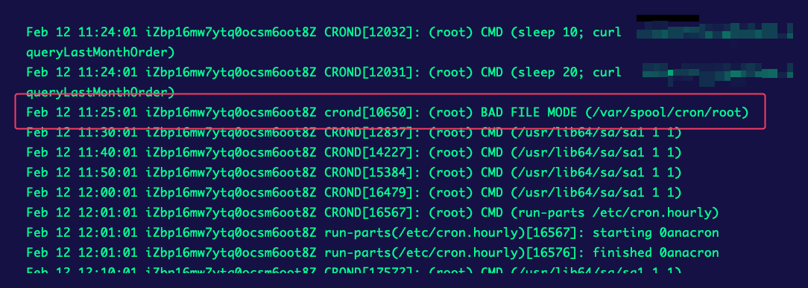

# 严重事故，Crontab 定时任务失效，随意修改目录权限的危害

公司的服务器几乎都让我来管理了，所以我平时在服务器上操作的也比较多。

我们公司的很多工作都是通过一台主服务器上的 `root` 用户的**定时任务**来实现的。

昨天同事下班时突然报告说定时任务**似乎**挂了，因为影响的主要是数据的归纳，所以我也没有太在意，简单的查看了下日志，确认部分服务还在运行，然后就下班了。

晚上老板给我发消息，说定时任务确实挂了，他测试手动执行任务是没问题的，问我的意见。

我也是一脸懵逼，定时任务能部分停止的吗？我看定时任务的日志还有新的呀，也就是说定时任务应该还在执行的，那为什么部分定时任务却没有执行呢？

## 问题排查

我赶紧登录服务器，再次仔细查看了最近的定时任务记录，不对劲，果然不对劲，`root` 用户自己添加的定时任务似乎都没有执行，而系统自带的定时任务却都在执行。

可看下图，从 `11:24` 以后，就没有再执行 `root` 用户的定时任务了，而且可以看到一条错误记录：`BAD FILE MODE (/var/spool/cron/root)`

看来问题就出现在 `BAD FILE MODE` 这个错误上了，这个错误通常是由于不正确的文件权限导致的。

我赶紧查看了下`/var/spool/cron/root`文件的权限，显示为`-rw----r-x`，**这里的 `r-x` 结尾是不对的！** `cron` 期望 `root` 的 `crontab` 文件权限是 `600`，而我的权限是 `605`（`-rw----r-x`），这会导致 `cron` 拒绝执行 `root` 用户的任务。

## 分析原因

因为我平时不会用 `root` 账户来登录服务器，昨天想查看一个服务下的日志目录有哪些文件，但是因为权限问题我却无法进入 `/var/log` 目录。

我当时想着日志目录开放出读和执行（为了进入目录）权限应该也没啥，于是就计划给 `/var/log` 目录 `r-x` 权限，但我错误的把权限给了 `/var` 整个目录，而且还用了 `-R` 递归参数，于是就导致了 `/var/spool/cron` 目录下的 `root` 文件的权限也被修改了。

## 解决方案

我赶紧修改了 `/var/spool/cron` 目录下 `root` 文件的权限，将其权限改为 `600`，然后重启了 `cron` 服务，问题解决。

另外 `/var` 目录下还有很多目录及文件也被我修改了权限，所以赶紧对比另外一台服务器，重新整理了一下权限，幸好我修改的都是 `o+rx` 权限，整理时也只需要把权限改为 `o-rx` 即可。

## 自我反思

我确实从没想过**增加权限会导致部分服务无法继续工作**，所以在权限操作上确实大意了，随意修改了目录权限。

我现在深刻体会 `最小权限原则` 的重要性，不会再轻易使用 `-R` 递归参数，也不会再随意修改目录权限了。
