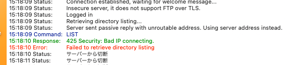
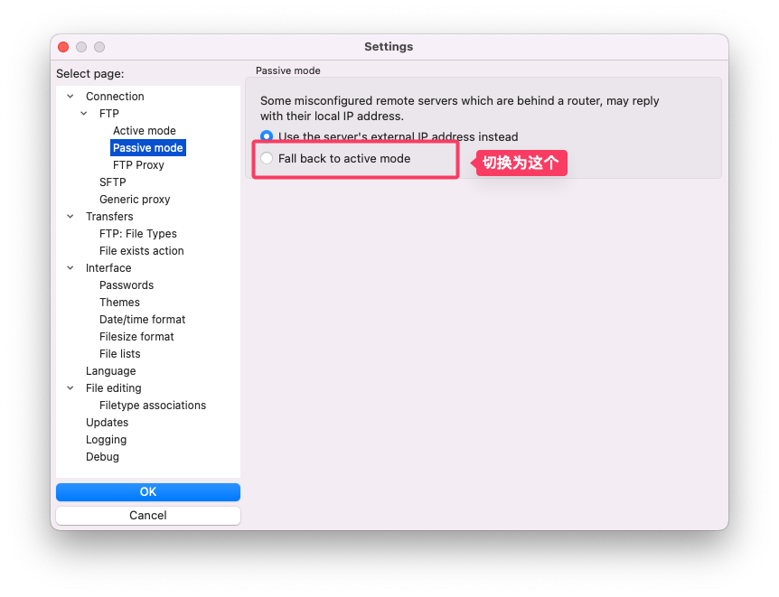

# 更换公司网络后 FTP 客户端无法连接问题解决，passive reply with unroutable address 错误解决方案

最近公司搬到了一个新地方，网络于是也就换了。

我们公司很多同事依然是使用 FTP 来连接服务器并上传文件的，今天就报告说 FTP 连接不上了。

我确认后就有点迷惑了，服务器除了我应该没人会去动的，为什么会突然 FTP 连接不上了？

于是我要来了同事们用的账号密码，自己尝试用 FileZilla 连接，看到报错：

`Server sent passive reply with unroutable address. Using server address instead.`

`425 Security: Bad IP connecting.`



这么可爱的问题当然要交给 AI 思考了，于是把错误发给了 ChatGPT，它巴啦啦回答了一堆原因，简单排除了下，猜测可能和连接模式有关。

FTP 有 **主动模式（Active Mode）** 和 **被动模式（Passive Mode）**两种连接模式，它们的连接方式是不同的，FTP 客户端默认都是用的被动模式，会要求客户端连接服务器的高端端口，但某些网络可能会阻止访问中这些端口。

## 问题解决

在 FTP 工具中，把被动模式改成主动模式就可以了。

比如我使用的 FileZilla，只需要在设置里面，把默认的模式切换为 `Fall back to active mode` 即可：



再次尝试问题就解决了。

## 拓展

网上有一种方案是修改 FTP 的配置文件 `vsftpd.conf` 增加以下内容：

```bash
# 把 192.168.2.1 换成 你服务器的公网 IP
pasv_address=192.168.2.1
pasv_min_port=50000
pasv_max_port=55000
```

这种应该仅适用于两台服务器之间的 FTP 连接，因为个人设备是没有公网 IP 的。
