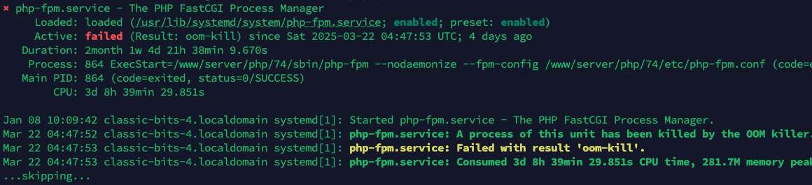

# OOM-killer 是什么，为什么会导致 PHP 服务挂掉

真的是有点无语，今天无聊点了下之前部署的几个网站服务，发现返回 502 错误，以为是服务器挂掉了。

结果还能登录，一切操作正常，赶紧排查，最后锁定了问题，是 PHP 服务挂掉了。

查看了下 `php-fpm` 状态，已经停止服务了，有一条错误信息：`php-fpm.service: A process of this unit has been killed by the OOM killer.`

## OOM-killer 是啥

`OOM`全称是`Out Of Memory`，这是 Linux 的 “内存保护机制”。

当系统内存耗尽时，为了防止崩溃，会自动选择 “吃内存最多” 或 “不重要” 的进程杀掉，以保证系统核心服务不崩溃。

而在我这里，因为主要用的服务还是 `php-fpm`，所以理所当然的，它就被停止了。

原因找到，重启下 `php-fpm` 服务，网站就都恢复了。

## 更多

如果服务器内存太小，还是挺容易导致 `php-fpm` 或者 `mysqld` 服务挂掉的，可以考虑增加内存或者优化服务配置来解决下，比如我这里，可以考虑调整下 `php-fpm` 的 `pm` 模式，或者调整下 `mysql` 的 `innodb_buffer_pool_size` 等。

另外，交换内存也是一个不错的选择，可以在内存不足时，把一部分硬盘空间当作内存使用，这样可以避免 OOM-killer 杀掉服务。
