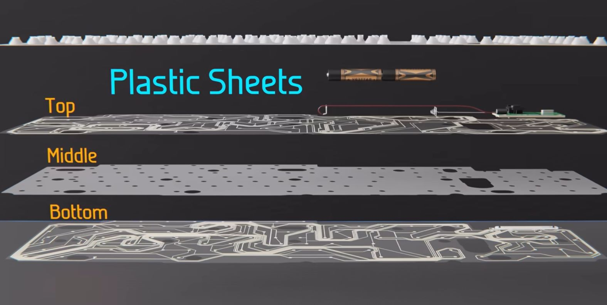
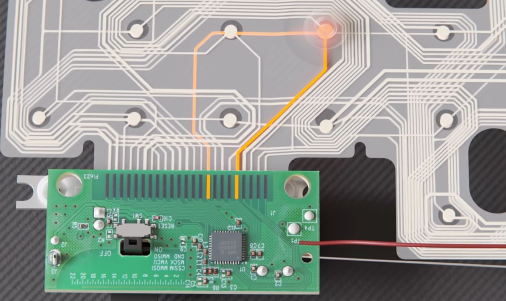
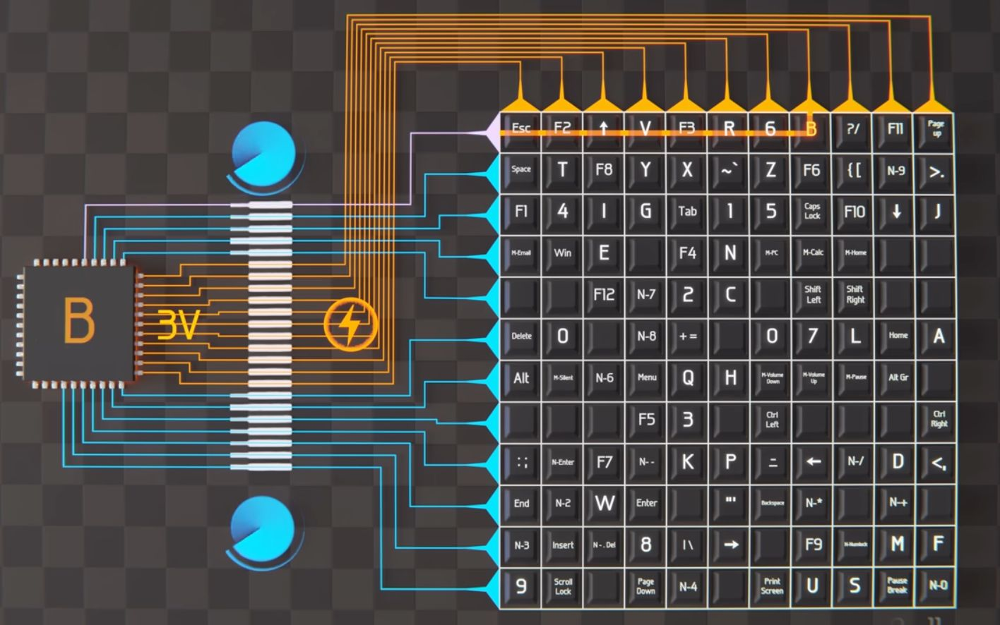
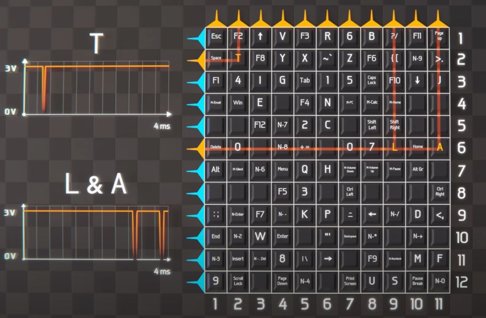
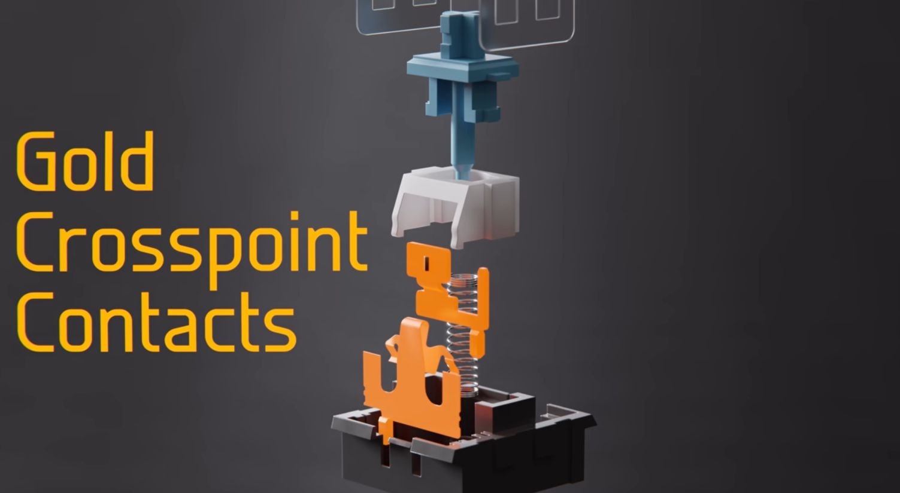
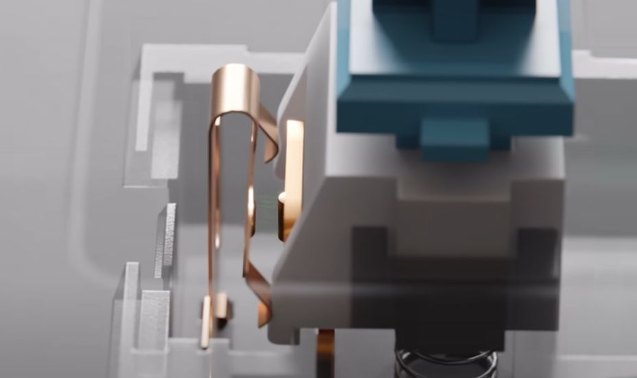

# 多图讲解薄膜键盘和机械键盘的工作原理

> 本笔记来自视频：https://www.youtube.com/watch?v=h-NM1xSSzHQ

## 薄膜键盘 Membrane Keyboard

拆开键盘后，我们会发现内部包含两层印刷电路片，中间通过一层隔离材料分开，如下图所示：

底层电路板上始终有3V的低电压。当上层电路板的触点被按下时，通过中间片材的孔洞接触到底层电路板，这样上下两层电路板就会接触通电，微处理器接收到信号后，即可判断按键被按下：

上下电路板分别有11路和12路连接，可以组合出132种不同的信号，而我们常用的键盘只有111键，因此完全足够使用：

如果仔细思考一下，你可能会问：底层电路板如果一直通电，那微处理器是如何知道哪一条线路被接触呢？

实际上，底层电路板的电路一直在发送脉冲信号，微处理器通过不断扫描整组信号，来判断哪个按键被按下。当按键被按下时，该路信号会被关闭，微处理器据此判断是哪一路信号被触发：

## 机械键盘

相比之下，机械键盘的原理更为简单。机械键盘的每个按键都与一块印刷电路板直接连接，当按键被按下时，会直接发送一个独立的信号。

唯一需要关注的是，机械键盘的按键是如何设计按下的。

每个按键由以下材料组成：

在默认情况下，由于塑料结构的设计，两个金属片不会接触：

当按键被按下时，塑料材料会向下移动，金属片便能接触，从而发出信号。

所以，当键盘不灵时，如果有人让你捅那个小孔，你知道是做做什么了吧，就是为了让金属片恢复下弹性。