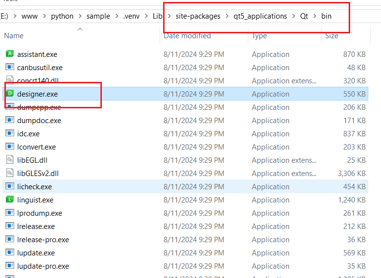
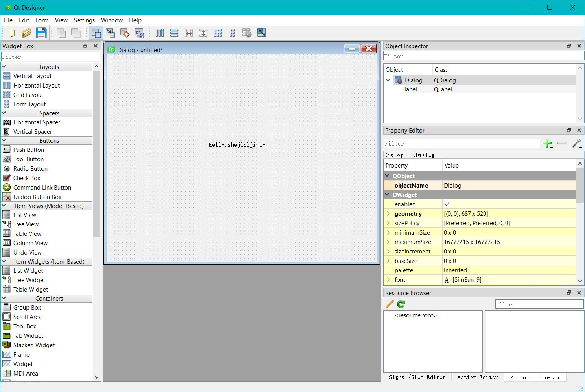
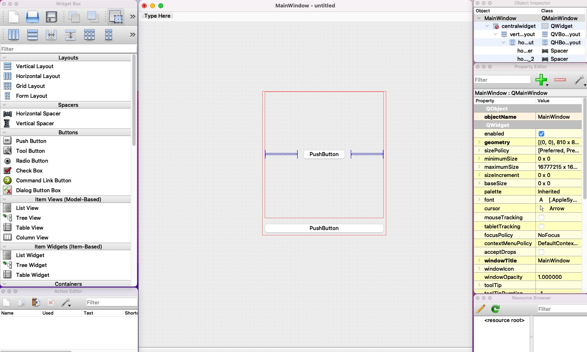

# 如何下载 Qt Designer，在 Mac/Windows 上使用 Qt Designer 的方法

目前在官网下载的安装包，已经不包含 Qt Designer，而是换成了 Qt Design Studio。我测试了下，感觉是挺强大的，只是整个界面也太干净了些，弹簧都找不到了，项目也比较着急，懒得再适应了，所以还是想换回 Qt Designer。

这里介绍一种方法，通过 `pyqt5-tools` 来快速安装 Qt Designer，而且不用担心下载到盗版。

`pyqt5-tools` 是一个工具包，它为 PyQt5 提供了一些附加工具，包括 Qt Designer、Qt Linguist 和其他与 Qt 开发相关的工具。

与直接从 Qt 官网下载的工具相比，`pyqt5-tools` 更加便捷，因为它可以通过 pip 直接安装，并且与 Python 环境集成得更好。

### 使用 `pyqt5-tools` 实现 Qt Designer 的工作流程

1. **安装 `pyqt5-tools`**:

   - 你可以通过 pip 安装 `pyqt5-tools`，这将自动安装 Qt Designer 和其他相关工具。

   - 在终端（macOS）或命令提示符（Windows）中运行以下命令：

     ```bash
     pip install pyqt5-tools
     ```

2. **启动 Qt Designer**:

   - 安装`pyqt5-tools`后，你可以通过以下命令启动 Qt Designer：

     ```bash
     python -m pyqt5_tools.designer
     ```

   - 这将启动与 PyQt5 一起工作的 Qt Designer，你可以在其中设计你的界面。

   - 如果这一步报错无法找到模块，你可以在下面寻找对应解决办法。

3. **创建和使用 `.ui` 文件**:

   - 在 Qt Designer 中创建界面后，将其保存为 `.ui` 文件。
   - 你可以选择将 `.ui` 文件转换为 Python 代码，或直接在代码中加载 `.ui` 文件。

### Windows 如何找到 Qt Designer

在 Windows 上通过 pip 安装后，有时候模块中还是找不到 `Qt Designer`，这个时候就需要我们自己去对应的文件夹去查找，你可以按照以下步骤操作：

1. **找到安装路径**：首先，你需要找到`pyqt5-tools`的安装路径。通常，它位于 Python 的`site-packages`目录下。你可以在命令行中使用以下命令找到它：

   ```bash
   pip show pyqt5-tools
   ```

   在输出中找到`Location`，这会显示`pyqt5-tools`的安装路径。

2. **导航到工具目录**：进入`pyqt5-tools`的安装目录，通常路径类似于：

   ```bash
   <Python安装路径>\Lib\site-packages\qt5_applications\Qt\bin
   ```

   例如，可能的路径是：

   ```bash
   C:\Users\<你的用户名>\AppData\Local\Programs\Python\Python<版本号>\Lib\site-packages\qt5_applications\Qt\bin
   ```

3. **运行 Qt Designer**：在上述路径下找到`designer.exe`，双击它就可以启动 Qt Designer 了。

比如我的电脑，就可以在虚拟环境中的`qt5_applications`文件夹中，找到对应的执行应用程序：



打开后就可以看到熟悉的界面了，真香：



### Mac 如何使用 Qt Designer

在 Mac 上我尝试使用`pip install pyqt5-tools`来安装，但是它总报错：

```bash
The conflict is caused by:
    pyqt5-tools 5.15.9.3.3 depends on pyqt5-plugins<5.15.9.3 and >=5.15.9.2.2
    pyqt5-tools 5.15.4.3.2 depends on pyqt5-plugins<5.15.4.3 and >=5.15.4.2.2
    # more messages ...
    pyqt5-tools 5.14.0.2 depends on pyqt5-plugins~=5.14.0.1.0.dev0

To fix this you could try to:
1. loosen the range of package versions you've specified
2. remove package versions to allow pip to attempt to solve the dependency conflict
```

在网上找了下解决办法，很多人说只要更换 python 的版本即可，不要使用最新的。

但是我着急设计，也没有时间再去更换 python 版本了，所以就试图寻找别的办法，最终找到这样一个网站：

[Qt Designer Download for Windows and Mac](https://build-system.fman.io/qt-designer-download)

大概看了下，像是正规网站，也就直接使用了网站提供的安装包了，只是打开后，窗口似乎碎掉了，像这样：



看了下，倒是能正常使用，索性也就不纠结了，直接开工！
