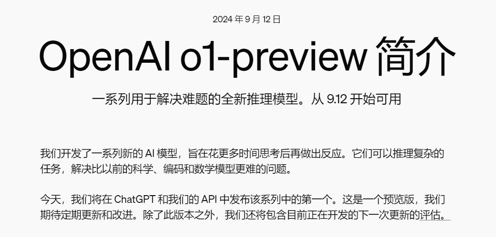

# OpenAI又有新模型？o1-preview 和 o1-mini 是什么？

今天打开 ChatGPT，发现又新增了两款新的模型：o1-preview 和 o1-mini，看这个名字是完全理解不了有什么不同。

打开官方介绍了解下才知道原来是：“一系列用于解决难题的全新推理模型”。

### o1-preview 和 o1-mini 的不同

那么和之前的GPT-4o相比，o1-preview 和 o1-mini，又有什么不同呢？

1. **GPT-4o**：这款模型是三者中最通用的，适合广泛的任务，包括处理文本、音频、图像和视频输入输出。它支持包括记忆、自定义指令、数据分析等高级功能。对于大多数用例，特别是涉及工具和视觉的任务，这是推荐的选择。
2. **o1-preview**：这款模型擅长复杂的问题解决和推理任务。它特别适用于研究、战略规划和高级教育环境中的应用。然而，它缺少 GPT-4o 的一些能力，如记忆、文件上传和浏览功能。它被设计用来处理复杂的问题并提供详细的响应，非常适合于高级认知任务。
3. **o1-mini**：这是一款成本效率高的模型，专为快速响应而优化，主要设计用于编码和 STEM（科学、技术、工程和数学）推理任务。在各种推理基准测试中表现良好，特别是在需要复杂推理的领域中，以其快速得出结论的能力受到青睐。与 o1-preview 一样，它也缺少 GPT-4o 的某些功能。

o1-preview 和 o1-mini 都被视为预览模型，对一些 OpenAI 的工具和功能有限的访问权限，它们具有特定的每周消息限制。这些模型计算密集型较高，因此设置这些限制是为了有效管理资源使用。

### 适合哪些人群

如果您正在解决科学、编码、数学和类似领域的复杂问题，这些增强的推理能力可能特别有用。例如，医疗研究人员可以使用 o1 来注释细胞测序数据，物理学家可以使用 o1 来生成量子光学所需的复杂数学公式，各领域的开发人员可以使用 o1 来构建和执行多步骤工作流程。 

所以，对于需要高级推理或在编码或数学等领域进行专业问题解决的任务，o1 模型可以特别有用。

相反，对于更一般的任务，如果需要广泛的能力，GPT-4o 仍然是首选模型。