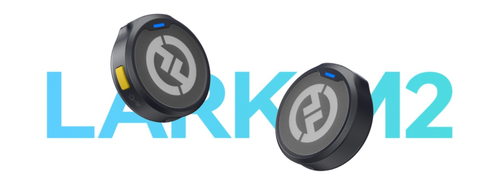
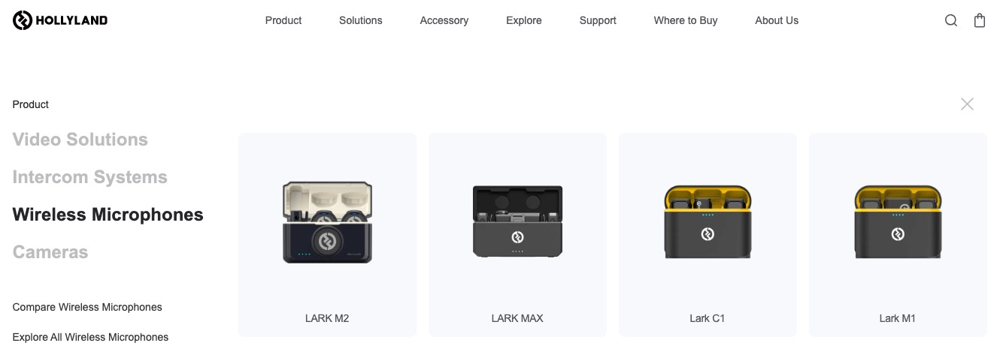
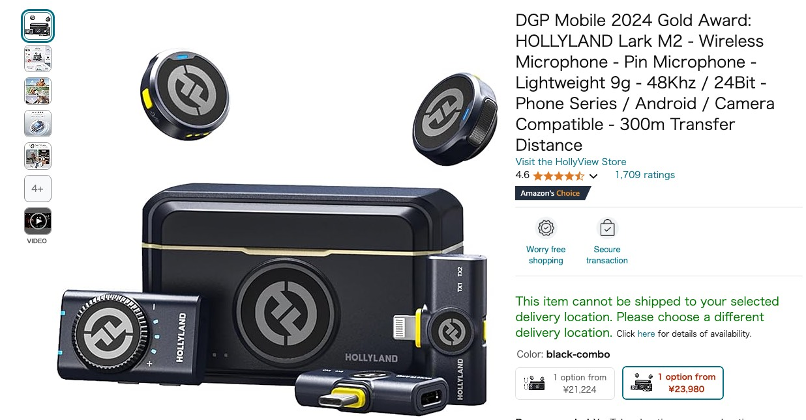

# 猛玛 MOMA 和 Hollyland 有关系吗？是不是同一个品牌？

最近在油管上看到了一款超级酷的无线麦克风设备 LARK M2，收音设备特别小巧，看着就很有科技感，产品官网也做的超级酷。

看完宣传页就觉得这家公司挺厉害的，但是当我打开产品页的时候，又感觉特别熟悉，和中国的某一个品牌很像，也说不上来原因，于是我就去了解了下。

我猜的没错，其实 Hollyland 就是深圳市昊一源科技有限公司旗下的一个海外子品牌。他们家在国内更有名的品牌名是："MOMA" 猛玛，如果是关注这方面信息的话，应该都有听过这个品牌。

以下是这家公司的官网介绍：

**"MOMA" 猛玛是深圳市昊一源科技有限公司旗下品牌。**

深圳市昊一源科技有限公司成立于 2013 年，是一家集研发、生产、销售于一体的高科技设备厂商，已深耕在无线领域十年多，为全球客户提供最优质的数字高清音视频传输整体解决方案。企业外设武汉研发基地和美国、欧洲两子公司，旗下拥有两大品牌：**海外为 Hollyland、国内为 MOMA，**服务全球 80 多个国家和地区，超 100 万视频创作者。

目前国内品牌 MOMA 猛玛有小玛、LARK、传奇、野玛、探境等多个无线设备系列，在直播相机、无线麦克风、无线图传、无线通话领域有着属于自己的核心技术。相关产品广泛应用于剧组影视拍摄、Vlog 视频制作、视频内容创作、婚礼录制、直播活动、访谈采访、学校展会、广电舞美、电信工业、电商直播等各领域。

厉害的是这样的产品在国外也就卖 1000 多，感觉应该会很能打：

很高兴可以看到越来越多国内的品牌出海的趋势，这样不仅可以让更多国外用户认识到中国品牌的实力，也可以让国内的品牌更好的服务全球用户。
