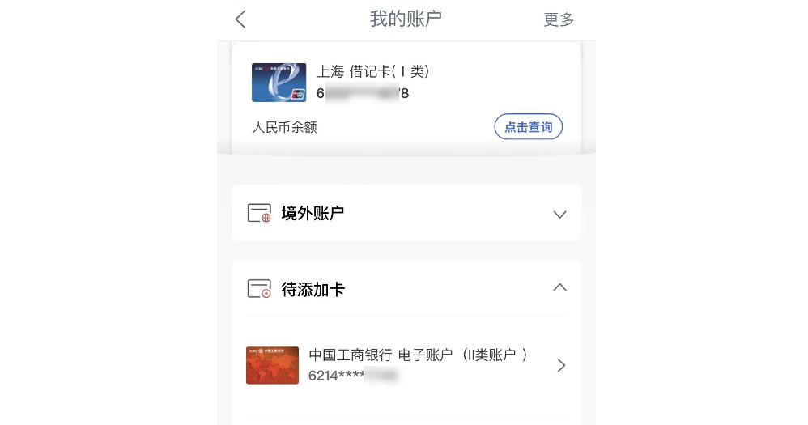
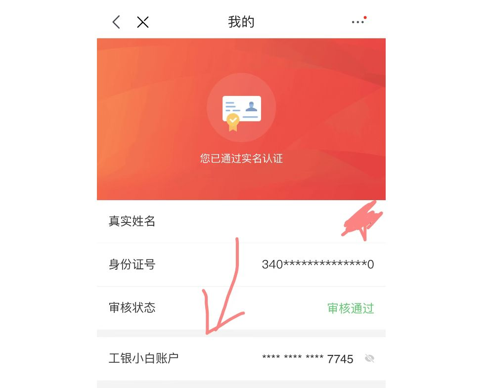
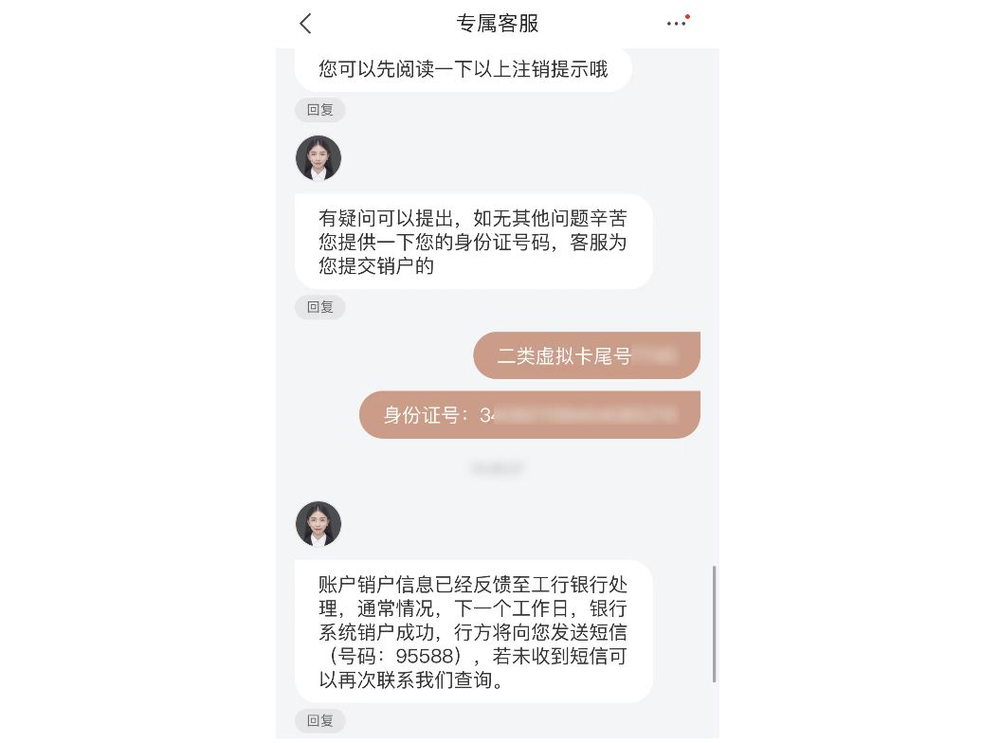

# 京东虚拟二类银行卡工银小白虚拟账户注销方法

最近在工商银行查询到有一个二类虚拟账户，试图绑定工商银行 APP，却绑定失败。

于是今天去银行营业厅申请注销，但是却被拒绝了，因为该卡为“**地方特色银行卡**”，但是给了我提示，这张卡和京东有关。

打开京东钱包，找到京东白条客服，联系他们，一番沟通后，才知道这个卡叫**工银小白**，属于京东和银行合作开通的白条卡。

**查询路径**：金融服务 --> 工银小白 --> 点击头像 --> 再次点击头像（进入实名认证信息页） --> 工银小白账户（这里可以看到完整卡号）

可惜我从来都没用过，却一直出现在我的账户列表中，而且我自己完全不知情，就很反感，于是联系客服注销。

一番沟通确认后，终于获得京东客服给的答复，已提交账户销户，等待银行处理了。

如果确定不需要，也可以根据相同方法注销掉，谁愿意莫名多一个虚拟账户，还完全不受自己管理的？

