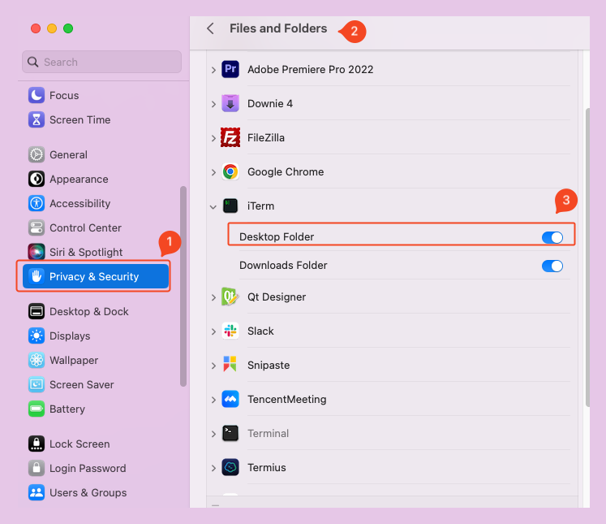
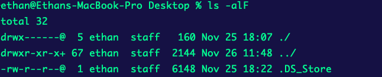

# 在 macOS 上拒绝了应用程序访问桌面文件夹权限，如何重新允许这个权限

今天用 iTerm2 访问桌面文件夹时，系统询问是否允许访问，我当时有事就直接取消了，结果之后访问桌面文件夹时都是直接被拒绝了，也不再询问是否允许。

那么如果我想重新启用允许这个应用访问指定的文件夹该如何做呢？

1. 打开“系统偏好设置”（可以通过点击屏幕左上角的苹果标志，然后选择“系统偏好设置...”）。

2. 点击“安全性与隐私”。

3. 点击窗口顶部的“隐私”标签。

4. 在左侧的菜单中找到并选择“文件和文件夹”。

5. 在右侧的列表中，找到被拒绝的应用程序，旁边会显示对应的文件夹（如“桌面文件夹”）。

6. 勾选应用程序旁边的复选框，允许它访问桌面。

现在就可以正常的访问到桌面文件夹了：

