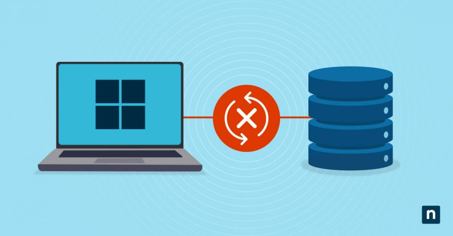
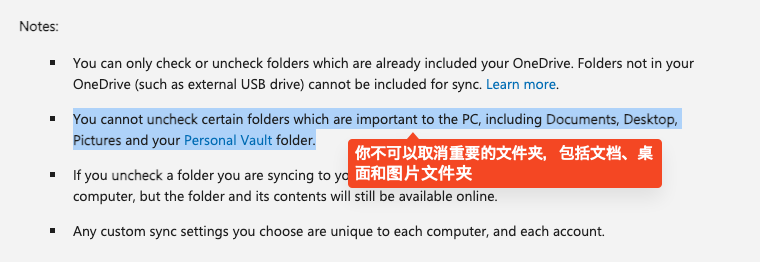

# 如何永久取消 Windows 的自动更新

之前一直开着 Windows 的自动更新，想着保持系统是最新的也挺好。

但是我今天是真的被震撼到了，最近自动更新后，微软自动帮我打开了 onedrive，然后开始同步我的桌面、文档和图片，我想取消还不允许，原因是重要位置的文件不能取消同步，我真的是服了，这是大公司能干的事情吗？

可以看看官方文档的说法: [Microsoft Support](https://support.microsoft.com/en-us/office/choose-which-onedrive-folders-to-sync-to-your-computer-98b8b011-8b94-419b-aa95-a14ff2415e85)，理由就是这句：

**你不可以取消重要的文件夹，包括文档、桌面和图片文件夹**

我真的是要骂娘了，凭什么呀，我自己电脑上资料，凭什么必须要传到你们的服务器啊？我真的要说谢谢……

## 取消自动更新

**自动更新** 现在看来是万万不能留了，那么该如何取消 WIndows 的自动更新了？

以下是四种最有效的方法，教你彻底取消 Windows 的自动更新。

### 禁用 Windows 更新服务

通过停止 Windows 更新服务可以禁用 Windows 更新，具体步骤如下：

1. 按下 **Windows 键 + R** 打开运行对话框。
2. 输入 **“services.msc”** 并按 Enter 键打开服务窗口。
3. 向下滚动找到 **“Windows Update”** 服务。
4. 右键单击该服务，选择 **“属性”**。
5. 在属性窗口中，将 **“启动类型”** 更改为 **“已禁用”**。
6. 点击 **“应用”**，然后点击 **“确定”** 保存更改。

通过禁用 Windows 更新服务，可以防止 Windows 自动检查和安装更新。

然而，请注意此方法仅会暂时禁用服务，当服务重新启用时，更新仍可能会被安装。

### 更改组策略编辑器设置

通过组策略编辑器停止 Windows 更新也是一种有效的方法，步骤如下：

1. 按下 **Windows 键 + R** 打开运行对话框。
2. 输入 **“gpedit.msc”** 并按 Enter 键打开组策略编辑器。
3. 导航至 **“计算机配置” > “管理模板” > “Windows 组件” > “Windows 更新”**。
4. 双击 **“配置自动更新”** 打开设置窗口。
5. 选择 **“已禁用”** 选项以关闭自动更新。
6. 点击 **“应用”**，然后点击 **“确定”** 保存更改。

使用组策略编辑器可以更精细地控制 Windows 更新，您可以选择完全禁用自动更新，或者根据需要配置特定的更新设置。

### 设置网络连接为按流量计费

Windows 10 提供了一个名为 **“按流量计费”** 的功能，可以限制某些网络连接的数据使用量。通过将网络连接设置为按流量计费，可以有效防止 Windows 自动下载和安装更新。操作方法如下：

1. 按下 **Windows 键 + I** 打开设置应用。
2. 点击 **“网络和 Internet”**，根据您的连接类型选择 **“Wi-Fi”** 或 **“以太网”**。
3. 向下滚动并点击 **“高级选项”**。
4. 打开 **“按流量计费连接”** 的开关。

当网络连接设置为按流量计费时，Windows 将不会自动下载或安装更新。然而，此方法可能会阻止其他应用下载更新或同步数据，因此需要谨慎使用。

### 使用 Windows 注册表

通过修改 Windows 注册表，可以禁用自动更新。具体操作如下：

1. 按下 **Windows 键 + R** 打开运行对话框。

2. 输入 **“regedit”** 并按 Enter 键打开注册表编辑器。

3. 导航到以下路径：
   **HKEY_LOCAL_MACHINE\SOFTWARE\Policies\Microsoft\Windows\WindowsUpdate**

   _如果没有找到 WindowsUpdate，就自己新建一个键_

4. 右键单击 **“WindowsUpdate”** 文件夹，选择 **“新建” > “DWORD (32 位) 值”**。

5. 将新值命名为 **“AUOptions”**，并将其值设置为 **“2”** 以禁用自动更新。

6. 点击 **“确定”** 保存更改。

> 部分资料参考自：https://www.ninjaone.com/blog/4-ways-to-disable-windows-updates/
