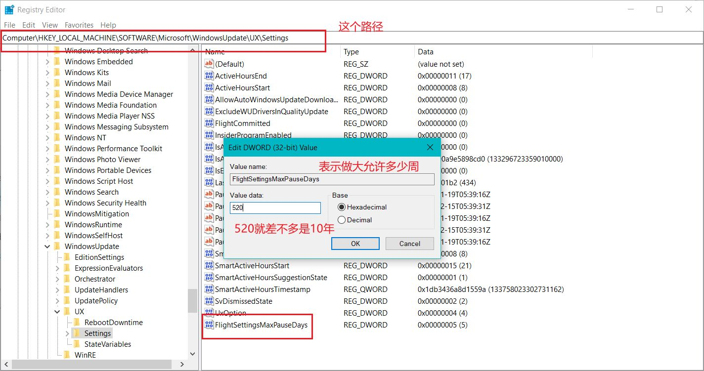
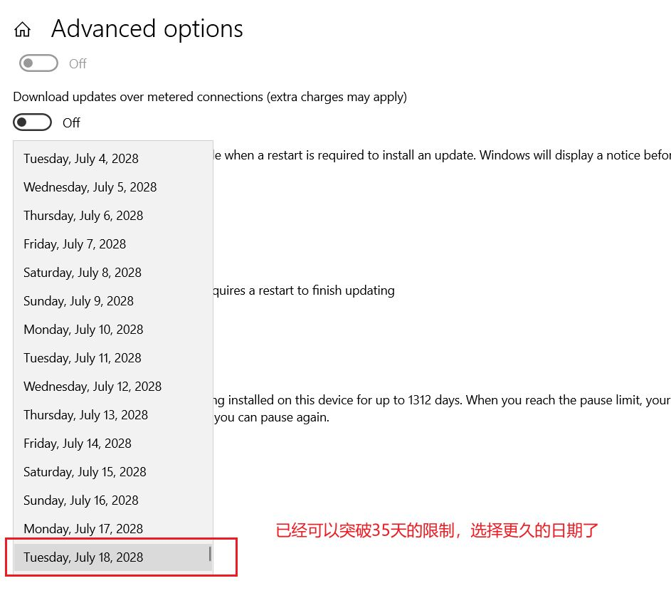

# 利用 Windows 暂停机制，真正永久停止自动更新功能

之前用了多种方法，来禁止 Windows 的自动更新功能，以为稳妥了，但是过一段时间，关机时还是提示更新并关机。

于是我就再次尝试取消掉这个更新并关机的功能，最终发现了一个真正有效的方法，那就是利用 Windows 的暂停机制。

## 暂停 Windows 更新

在 Windows 更新中，有一个暂停更新 7 天的功能，在高级设置中，可以暂停更新 35 天，当开启后，即使已经下载了更新，也不会再提示更新啥的，直到暂停结束，是真正停止了更新功能。

所以我在想是不是可以突破这个最长 35 天的限制，只要允许设置暂停更新的天数足够长，就可以利用官方的暂停机制，来实现真正永久停止自动更新功能。

在查看了网上对注册表的一些介绍后，我找到了一个可以设置暂停天数的注册表项，这个注册表项是 `HKEY_LOCAL_MACHINE\SOFTWARE\Microsoft\WindowsUpdate\UX\Settings`，在这个项中有一个名为 `FlightSettingsMaxPauseDays` 的 DWORD 值，这个值就是设置允许最多暂停的天数。

如果没有这个项，可以自己新建一个 DWORD 值，这个值表示最大允许的周数，比如我设置的是 520 周，也就是 3640 天，这样差不多就是 10 年的时间了。

现在再去 Windows 更新的高级设置中，就可以设置允许更久的暂停时间了，这样就可以真正永久停止自动更新功能了。

