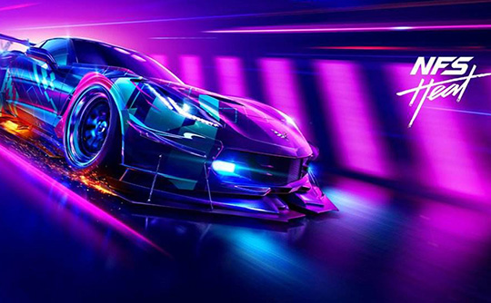

# 极品飞车 21 热度中那些不可或缺或者性能强者以及情怀之车

最近玩《极品飞车·热度》有点上头，自从到了 16 级后买到了**保时捷 911 RSR**，感觉无敌了现在，越玩越爽。

不过一直玩一款赛车也没意思，还有哪些值得拥有的不可或缺的性能强者呢？

**可以参考下面列表：**

- 马自达 RX-7 FD Spirit R '02

  甩尾

- SUBARU IMPREZA WRX STi '06

  拉力赛

- FERRARI 488 PISTA

  甩尾抓地两开花

- POLESTAR IK.S. EDITION

  封面上的车，北极星

- MAZDA MX5 MIATA '96

  满改后加速非常快

- 雪佛兰 CHEVROLET CORVETTE GRAND SPORT

  甩尾不丢失速度

- 三菱 MITSUBISHI LANCER EVO IX

  RSR Killer

- FERRARI FXX -K EVO

  加速快，综合实力强

- DODGE CHARGER 1969

  V8 发动机，转子劲敌

- PORSCHE 911 CARRERA RSR 2.8

  游戏中最强的车

- **BMW M3 GTR**

  最高通缉完全复刻版

- Audi R8

  奥迪粉的最爱
