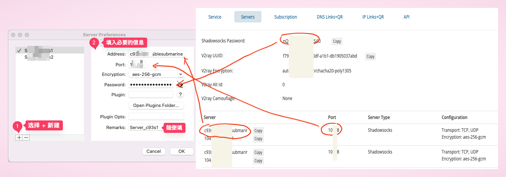
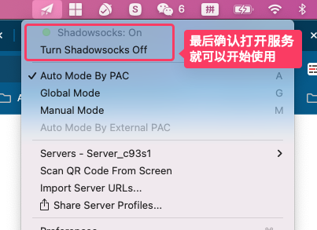

# Just My Socks 购买服务后配置教程

之前已经推荐过搬瓦工官方 Just My Socks 服务的购买及使用，具体可以看这个文章：[搬瓦工官方?Just My Socks 购买及使用教程分享](https://www.shejibiji.com/archives/9536)

但后台经常有人留言提问：购买后不知道如何配置，特别是配置 Shadowsocks 或者 V2ray，不知道如何操作。

今天就来分享下，如何配置 Shadowsocks。

## 配置教程

### 1. 登录 Just My Socks 并购买服务

首先当然是需要购买服务，国内可以直接访问官网：[Just My Socks](https://justmysocks3.net/members/aff.php?aff=29134)

具体如何购买服务，可以看之前的文章：[搬瓦工官方?Just My Socks 购买及使用教程分享](https://www.shejibiji.com/archives/9536)

### 2. 点击服务获取相关配置信息

购买后，在菜单中选择 `服务`→`我的服务`

就可以看到所有已经购买的服务了：

点击服务的标题，就可以进入服务的配置信息界面：

### 3. 下载客户端软件

打开官方知识库，找到软件下载链接。

官方知识库直达链接：[Knowledgebase](https://justmysocks3.net/members/index.php?rp=/knowledgebase/5/Software-download-links.html)

这里官方提供了多个设备的应用软件推荐，选择其中一个下载即可。

我这里下载的是 `shadowsocksx-ng`，也就是大家最熟悉的纸飞机，之后的教程以此为例。

其它的软件配置可以参考，应该都是一样的。

### 4. 配置连接信息

如果你在上一步下载的是 **jamjamsapp** 这款软件，由于它是支持订阅地址的，配置是最简单的，可以参考之前的文章：[搬瓦工官方?Just My Socks 购买及使用教程分享](https://www.shejibiji.com/archives/9536)就可以了。

**这里主要介绍下如何自己填服务配置信息**。

打开 shadowsocksx-ng 软件后，我们找到选项，选择 `Servers`，并选择第一个选项，具体看图：

然后参考下图，从网站上获取必要的信息并填入对应的位置即可：

点击 `OK` 就配置好了。

现在，确认在设置中打开服务，就可以开始使用了：

该文仅是对之前文章的一个补充，推荐阅读 [搬瓦工官方?Just My Socks 购买及使用教程分享](https://www.shejibiji.com/archives/9536) 后再阅读本篇文章。

祝上网愉快！
