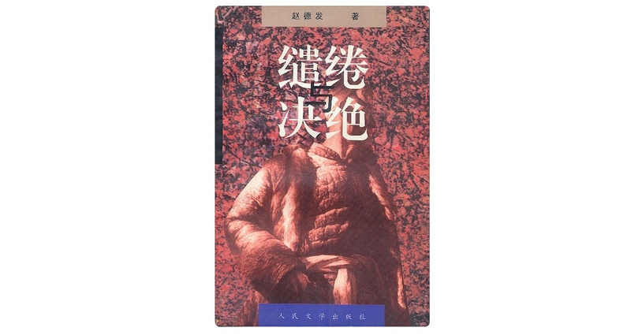

# 缱绻与决绝 1997 最初版 电子书全集 PDF 免费下载分享



> 简介：土地是农民的命，是农民的根。几千年来，在这命与根的土地上，中国的农民播种着他们的希望与寄托，耕耘着梦想与现实。在文学史上，作家们已为他们竖起了一座座丰碑，描述了世代农民在社会的变革中所经历的种种磨难与欢欣。然而本世纪中国发生的土地几聚几散的剧变，使农民在土地上的足迹又有了既深且远的延伸……本部小说正是以土地的变迁为背景，展现了农民求生存、求发展的艰难历程。

最近连续两天终于把《缱绻与决绝》看完了，写的真不错，值得推荐。

整本书讲述的故事，用书中的一段摘录表述就是：

```bash
接着，他就向宁遥讲了他的大姑。讲绣绣怎样被鄉票，她爹怎样舍女保地，绣绣回来后又怎样嫁了他。讲完这些，老汉又讲他与绣绣这六七十年的经历：租地、开荒、來鬼子、闹土x改、置地、办合作社、大跃x进、吃食堂、六零 年挨饿、文化x大x革x命、学大x寨、大包x干、两田制、开发区……
```

最后那句也是耐人寻味：`他翻来覆去想 不明白：如今的这地，到底是谁家的呢？是国家的，是个人的，还是村千部的呢？`

因为是原版的影印版 PDF，所有没有目录，我看的时候大概整理了下，可以用来参考，方便查阅。

## 缱绻与决绝目录

> 数字表示在 PDF 中的第多少页（并非实际的页码）
>
> 有些章节我稍微备注了下，供参考

- P6 第一卷 （初）

  - P6 第一章

  - P27 第二章

  - P47 第三章

  - P59 第四章

  - P80 第五章

    锈锈怀孕了

  - P98 第六章

  - P116 第七章

- P142 第二卷（1946 年）

  - P142 第八章

  - P158 第九章

  - P177 第十章

  - P195 第十一章（1948 年）

  - P213 第十二章

  - P235 第十三章

  - P262 第十四章

- P281 第三卷（1978 年）

  - P281 第十五章

    养丫、封合作（封铁头儿）、懒汉封大脚、宁可玉

  - P297 第十六章

    向阳岭战场指挥部、封家明

  - P319 第十七章

    摘帽

  - P338 第十八章

    宁可玉、小米

  - P360 第十九章

    分产到户

  - P376 第二十章

  - P396 第二十一章

- P416 第四卷

  - P416 第二十二章

  - P431 第二十三章

  - P452 第二十四章

  - P471 第二十五章

  - P489 第二十六章

  - P512 第二十七章

    天牛经济开发区、酒家被罚款

  - P531 第二十八章

```html
# 单独复制！
<h2>下载地址</h2>
<p>站内会员可以直接下载，如果不想注册，请按照提示关注公众号获取密码。</p>
[login]
<p>
  下载地址：<a href="https://pan.yzitc.com/s/gNIo"
    >https://pan.yzitc.com/s/gNIo</a
  >
</p>
<p>分享密码：shejibiji</p>
[/login]
<p>
  不知道怎么成为会员？<a href="https://www.shejibiji.com/register">
    [点我开始注册]</a
  >
</p>
<h3>免费下载链接</h3>
[wechat key=6666 reply=sheji]
<p>
  下载地址：<a href="https://pan.yzitc.com/s/gNIo"
    >https://pan.yzitc.com/s/gNIo</a
  >
</p>
<p>分享密码：shejibiji</p>
[/wechat]
```
