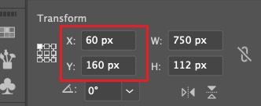

# Illustrator(AI)为什么导出的图片会多一个像素

今天使用 Adobe Illustrator 给程序设计了一张运行时的等待图片，尺寸设置为 100x100px，导出的时候发现导出的图片尺寸变成了 101x101px，我如何调整总是不对，感觉就非常奇怪。

经过一番搜索，发现了原因，原来是因为我没有对齐网格，而导致元素对齐不准确，所以导出的图片像素尺寸会不准确，多一个像素少一个像素都有可能。

知道原因其实就好解决了：

### 解决办法

1. 选中你要导出的元素

2. 调整元素的位置，确保不管`x`还是`y`轴都是整数，这样就可以保证元素对齐网格了

   

3. 之后导出图片，导出的图片尺寸就会和设置的像素尺寸保持一致了

### 更多建议

为了以后都可以对齐网格，我们可以在`视图`中，选择`对齐网格`，这样就可以保证以后设计的元素都是对齐网格的，不会出现导出图片尺寸不准确的问题了。
