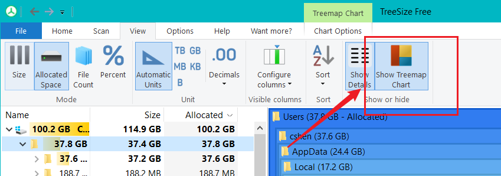
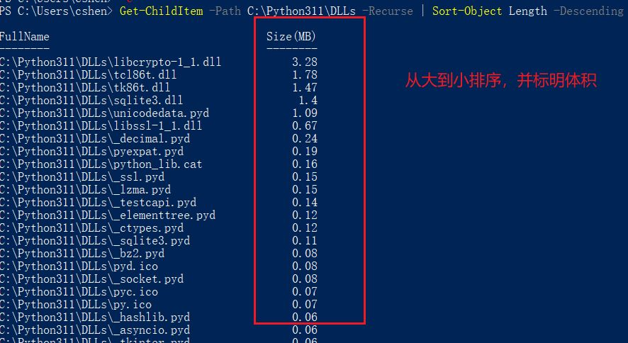

# 如何快速查看电脑哪些文件或目录占用空间比较大，并按照大小进行排序

电脑 C 盘装了一个 120G 的固态，奈何老家伙年纪大了，日积月累，现在的 C 盘资料越来越多，开始频繁的报红了。

于是我就想看看 C 盘到底那些目录或者文件比较大，一些不需要的就可以删掉，如果是可以迁移到其它盘的也可以挪走，免得盘符总是红色，看着也难受呀。

查了下资料，主要有以下两种方法：

## 方法一、使用软件查看

这种当然是最简单的，去网上搜了下工具，找到了一款非常实用的，名字叫：**TreeSize Free**，大概测了下，确实好用，界面类似下图这样：

_左边是文件夹列表，标明每个文件夹大小，可以自由展开查看文件夹内更详细的分布_


当然文件夹体积地图也是有的，就是右边那一块，默认是不打开的，可以在视图中，选择打开：



我下载的就是绿色便携版的，免费使用的，打开就可以直接用，下载链接我分享在文末了。

## 方法二、使用 PowerShell 查看

当然，作为一名程序员，有时候就不想用这些应用，也不想下载乱七八糟的软件，该怎么办呢？

可以直接使用微软自带的 **PowerShell** 就可以实现，只需要输入下面命令即可：

```bash
Get-ChildItem -Path C:\ -Recurse | Sort-Object Length -Descending | Select-Object FullName, @{Name="Size(MB)";Expression={[math]::round($_.Length / 1MB, 2)}}
```

这个命令的意思是：获取 C 盘下的所有文件夹，按照大小进行排序，然后选择显示文件夹的路径和大小。

效果如图：



其中的 `-Path C:\` 就是指定查看 C 盘，如果要查看其它盘，可以替换为 `D:\`、`E:\` 等，想查看具体的目录，可以替换为 `C:\Users`、`C:\Program Files` 等。

不过可不推荐扫描全盘，因为这个命令会扫描所有文件夹，如果文件夹比较多，会比较耗时，而且结果太多也不方便查看。

## TreeSize 下载地址
