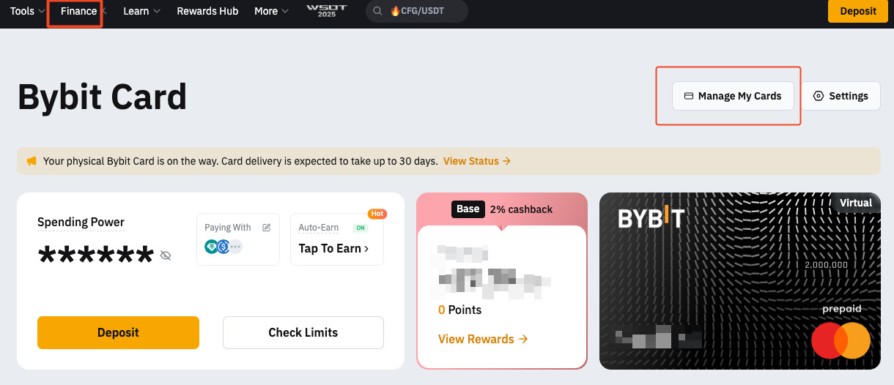

# 获取 BYBIT 实体卡方法，无需转运免费直邮中国万事达 U 卡

之前申请 [BYBIT](https://www.bybitglobal.com/invite?ref=ZGPJZPD) 卡的时候，听说申请实体卡需要澳大利亚的转运地址，很麻烦就没有弄了。

今天在网上看到一个挺骚的方法，据说可以获取 [BYBIT](https://www.bybitglobal.com/invite?ref=ZGPJZPD) 实体卡 一分钱不花 免入金 无需转运 免费直邮中国。

是一个视频教程，博主巴拉巴拉说了半个多小时，目的感觉也是为了推荐他的 [BYBIT](https://www.bybitglobal.com/invite?ref=ZGPJZPD) 邀请 🐴，有效的内容其实就是一句话的事情。

我自己也实验了下，反正是成功申请了，分享下。

## 申请流程

1.

**登陆 BYBIT，找到卡片**

登陆 [BYBIT](https://www.bybitglobal.com/invite?ref=ZGPJZPD) 后，在顶部菜单中，选择 `金融`，选择 `银行卡`

打开卡片页面后，选择右上角的 `管理我的卡片`

2.

**填写申请信息**

这一步是最核心的地方，就是：**填写地址时，不要修改国家选项，保留原来的选择**。

然后在地址中，填上自己的平邮地址，注意第三行要填写 `CHINA`，地址需要拼音或者英文，不能用中文。

这个可以找 `deepseek` 或者其它工具翻译一下。

PIN 就是自己的取款密码。

填写好后，就可以点击 `申请`，不出意外的话就可以看到申请成功的弹窗了。

3.

**等待**

接下来就是等待了，官方页面说可能需要 30 天才会寄出，加上平邮的时间，可能需要一个半月到三个月。

不过看评论区，也有说从申请到拿卡，总共也就一个月的，具体要看地区情况了。

之后我如果收到卡了，也会在评论区及时更新进度的。
