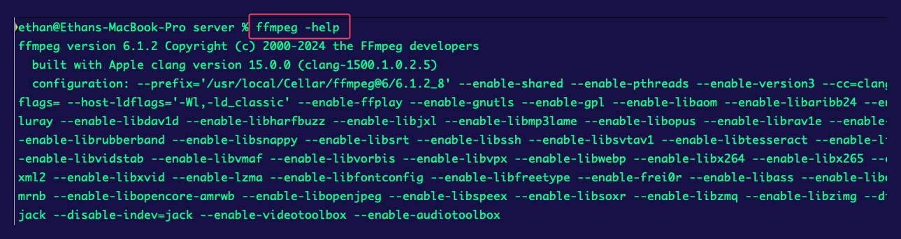

# 通过 Brew 安装的 ffmpeg 缺失库文件 libSvtAv1Enc.2.dylib 无法运行

今天有一个格式转换的需求，现在学会了 python，就习惯这种事情都用命令行应用去做，而我使用了 ffmpeg 这个著名的库来解决，结果运行时报错了，报错原文如下：

```bash
dyld[92143]: Library not loaded: /usr/local/opt/svt-av1/lib/libSvtAv1Enc.2.dylib
  Referenced from: <765B9E65-0125-33A4-829D-42DAED3878AD> /usr/local/Cellar/ffmpeg@6/6.1.2_6/bin/ffmpeg
  Reason: tried: '/usr/local/opt/svt-av1/lib/libSvtAv1Enc.2.dylib' (no such file), '/System/Volumes/Preboot/Cryptexes/OS/usr/local/opt/svt-av1/lib/libSvtAv1Enc.2.dylib' (no such file), '/usr/local/opt/svt-av1/lib/libSvtAv1Enc.2.dylib' (no such file), '/usr/local/lib/libSvtAv1Enc.2.dylib' (no such file), '/usr/lib/libSvtAv1Enc.2.dylib' (no such file, not in dyld cache), '/usr/local/Cellar/svt-av1/3.0.2/lib/libSvtAv1Enc.2.dylib' (no such file), '/System/Volumes/Preboot/Cryptexes/OS/usr/local/Cellar/svt-av1/3.0.2/lib/libSvtAv1Enc.2.dylib' (no such file), '/usr/local/Cellar/svt-av1/3.0.2/lib/libSvtAv1Enc.2.dylib' (no such file), '/usr/local/lib/libSvtAv1Enc.2.dylib' (no such file), '/usr/lib/libSvtAv1Enc.2.dylib' (no such file, not in dyld cache)
```

因为使用 Homebrew 安装的 ffmpeg，去网上搜了下，这个问题也很普遍，看来是 Homebrew 的问题。

在网上找了一圈最后解决了，所以赶紧记录下，希望能给之后的人提供一些帮助。

## 解决办法

1.

首先卸载掉 lame 组件，因为这个组件被其它应用依赖，还需要忽视，命令如下：

```bash
brew uninstall --ignore-dependencies lame
```

2.

重新安装 lame 组件，命令如下：

```bash
brew install lame
```

**这样就可以解决了。**



## 更多

另外网上也提到说重新添加链接也可以解决问题，命令如下：

```bash
brew unlink lame && brew link lame
```

我没有尝试，可能也能快速解决问题。
