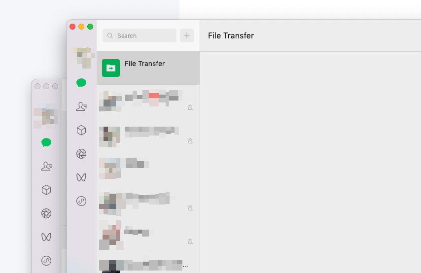
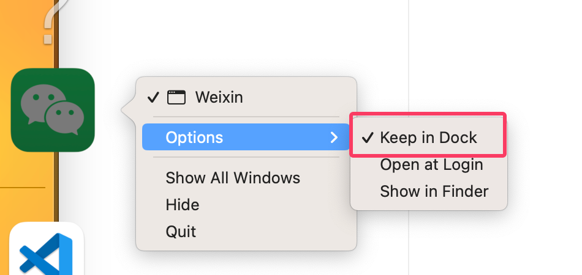

# 新版本微信 MacOS 最新多开方法(4.0 以上)

## 操作步骤

首先我们要打开 MacOS 上的终端，然后无脑按照以下四步执行命令即可：

### 复制微信应用

```bash
sudo cp -R /Applications/WeChat.app /Applications/WeChat2.app
```

### 修改 Bundle ID

这一步时为了防止微信检测为同一应用：

```bash
sudo /usr/libexec/PlistBuddy -c "Set :CFBundleIdentifier com.tencent.xinWeChat2" /Applications/WeChat2.app/Contents/Info.plist
```

### 重新签名应用

```bash
sudo codesign --force --deep --sign - /Applications/WeChat2.app
```

### 终端启动第二个微信

第一个微信先手动打开，然后再执行下面命令启动第二个微信：

```bash
nohup /Applications/WeChat2.app/Contents/MacOS/WeChat >/dev/null 2>&1 &
```

### Enjoy

现在就可以打开两个微信了：



第二个终端应用启动后，可以选择右键在 `程序坞中保留`，这样下次直接点程序坞的程序就可以运行了。



而且也不会产生一个无法关闭的终端，就非常的实用！
