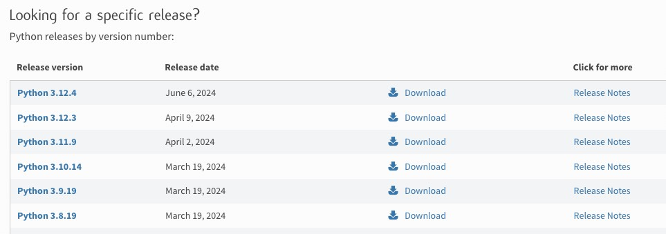
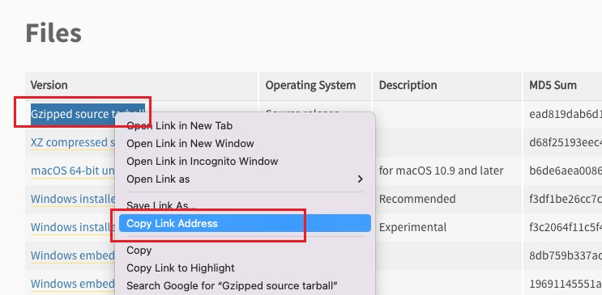
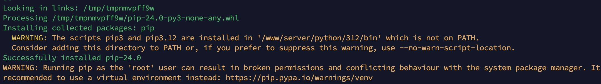
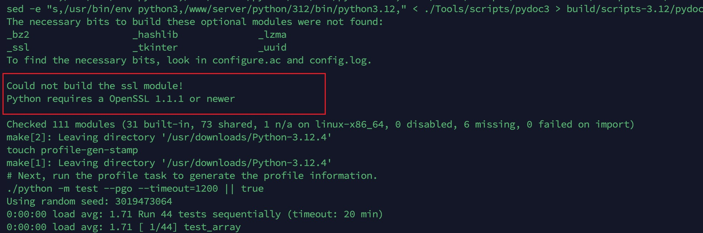

# 如何在 Linux 系统中编译安装更新 Python3

> https://www.cnblogs.com/jsdy/p/12694908.html
>
> https://blog.csdn.net/lockhou/article/details/125935799
>
> https://phoenixnap.com/kb/how-to-install-python-3-ubuntu
>
> https://blog.csdn.net/mbdong/article/details/127662406

> https://www.cnblogs.com/mooremok/articles/16380325.html


想用 python + flask 在服务器提供一个简单的接口，使用 Gunicorn 在服务上运行部署，但是却报错：

```bash
NameError: name 'ModuleNotFoundError' is not defined
```

搜索了下原因，是因为 Python 版本的问题，就想着升级下服务器上的 Python 版本，于是就有了今天的这个笔记记录。

## 编译安装 Python3 步骤

### 1. 下载 Python3 的源码

官方下载：https://www.python.org/downloads/

进去后，找到自己需要的版本



选择版本后，翻到网页底部，找到文件列表，右键复制地址



### 2. 编译安装 Python3

mkdir -p /www/server/python/312

配置

```bash
./configure --prefix=/www/server/python/312 \
--enable-optimizations
```



/www/server/python/312/bin/python3
/www/server/python/312/bin/pip3

### 3. 链接

rm -rf /usr/bin/python

ln -s /www/server/python/312/bin/python3 /usr/bin/python3
ln -s /www/server/python/312/bin/pip3 /usr/bin/pip3

## 可能遇到的问题

### SSL module is not available(SSL module failed)

SSLError("Can't connect to HTTPS URL because the SSL module is not available.")



```bash
Could not build the ssl module!
Python requires a OpenSSL 1.1.1 or newer
```

这是由于编译时，ssl 模块没有被成功构建，Python 编译时，忽略该错误并继续编译了。

解决办法需要重新构建安装 Python。

**解决办法**

首先安装新版本的 **OpenSSL**，版本等于大于`1.1.1`，然后再重新配置并编译安装。

为了稳妥也可以自己指定 OpenSSL 的文件位置，只需要在配置时增加该项：

```bash
--with-openssl=/usr/local/ssl
```

如果没有问题，在 **make** 时，最后就不会再出现该错误。

编译成功后，可以运行 python，并输入下列命令来测试：

```python
import ssl
ssl.OPENSSL_VERSION
```
