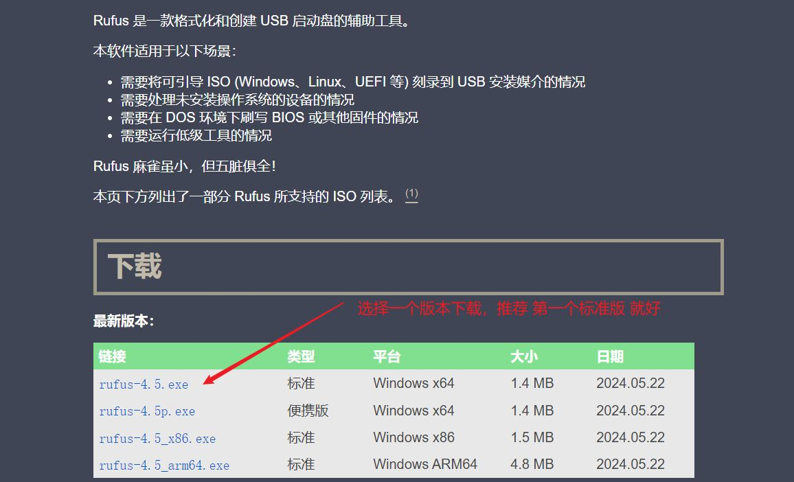
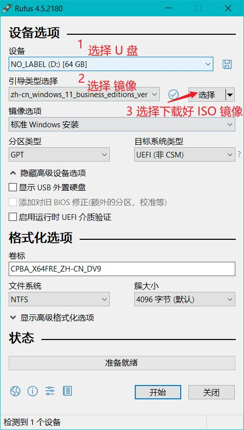

# 快速自己安装 Windows 操作系统，使用 Rufus 自制启动 U 盘

陆陆续续也安装了很多次 Windows 操作系统了，神奇的是，每次用的工具还不一样，从以前的老毛桃、大白菜，到后面的微 PE，安装都比较顺利，国内这些傻瓜工具做的真的都挺好，所以一直也没特意纪录过。

这次是因为家里的 Windows 电脑，偶尔天热会蓝屏，加上主板还是 B150M-A，确实有点老，所以就打算换一台新的电脑，所以准备开始再次折腾装机了。

这次网上大概逛了下，发现国外似乎还真的没有那么啥 WinPE 的工具，所以这次也准备放弃 WinPE，准备用 U 盘做一个启动盘，引导下 ISO 镜像，简简单单安装下得了。

这次想着也不复杂，顺手也记录下，方便以后也可以随时查阅。

首先打开 Rufus 官网：[Rufus](https://rufus.ie/zh)

