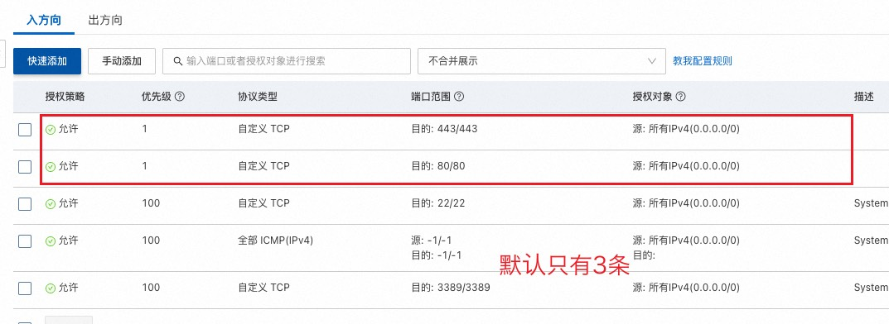
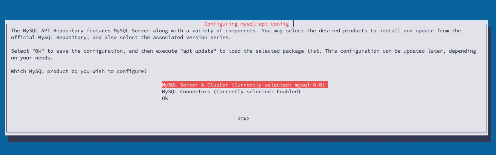
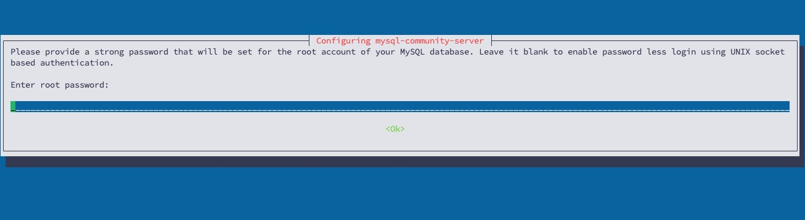
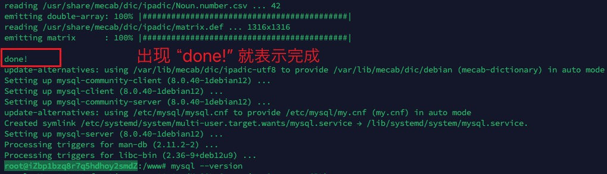

# 告别宝塔，手动搭建部署 web 服务器，自安装 nginx 等服务

**目录结构**

- 所有自己添加及修改的内容放在 `/www` 目录下（不包括 nginx 这种基础服务）
- /www/server 安装的服务放在这里，包括 php、mysql、nodejs、go_project、cron、
- /www/backup/site 网站备份数据
- /www/vhost 网站各种配置及证书等
- /www/vhost/cert
- /www/vhost/nginx

**要做的事情**

- ✅ 安装 nginx
- ✅ 安装 php-7.4
- ✅ 安装 mysql 5.7（最终安装了8.0）
- 网站迁移工作
  - 网站文件及数据的迁移
    - ✅ www.yzitc.com
    - ✅ tool.yzitc.com
    - ✅ chat3.yzitc.com
    - ✅ chat.yzitc.com
    - ✅ api.yzitc.com
    - ✅ pan.yzitc.com
    - ✅ img.yzitc.com
    - 备份 shop.yzitc.com
  - ✅ 域名绑定目录
  - ✅ SSL 证书的绑定（证书已迁移）
  - ✅ 伪静态
  - ✅ 反向代理
- ✅ 利用 supervisord 实现进程守护管理
- 实现 SSL 证书的自动申请及部署 conf/nginx.conf

## 安装 nginx

阿里云安装的 Debian 服务器默认没有 ufw 防火墙，而是有自己的安全组，默认没有打开 80 和 443，需要添加规则放行。

## 安装 php-7.4

如果要实现类似宝塔随意切换PHP版本的效果，几个文件是必要的

- /etc/nginx/enable-php.conf
- /www/server/php/74/etc/php-fpm.conf
- /www/vhost/nginx/shejibij.com.conf

## 安装 MySQL

> 参考文章：[How to Install MySQL on Debian 12](https://docs.vultr.com/how-to-install-mysql-on-debian-12)

wget  https://dev.mysql.com/get/mysql-apt-config_0.8.33-1_all.deb

sudo dpkg -i  mysql-apt-config_0.8.33-1_all.deb

输入密码：

安装完成：

