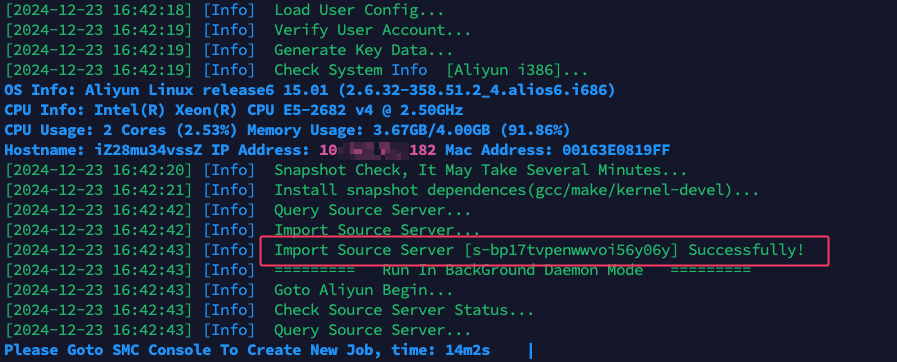
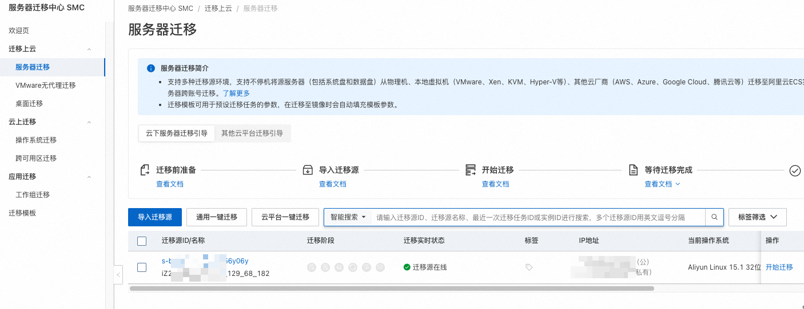
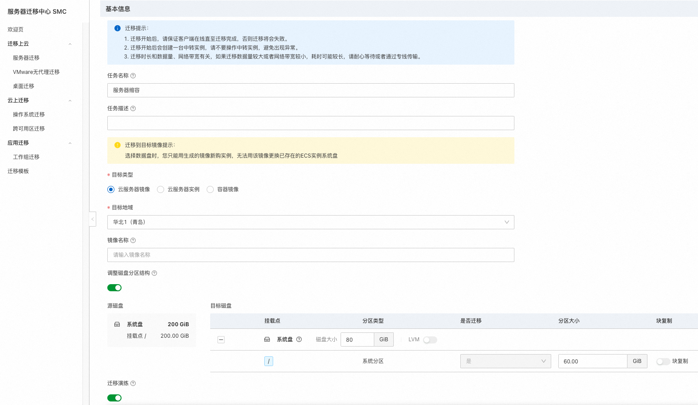
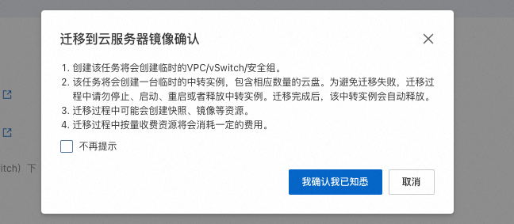
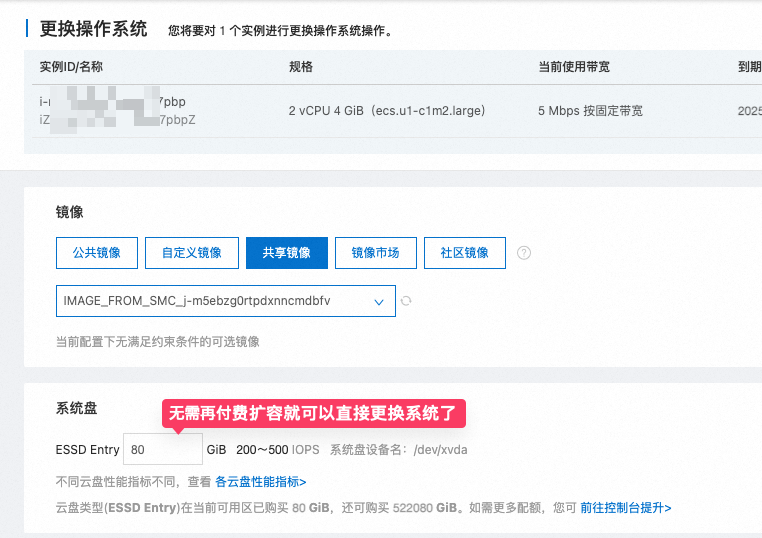

# 解决阿里云系统盘大小不同，无法直接使用镜像迁移的问题，阿里云服务器 SMC 迁移教程

下午正在悠哉的敲着代码时，领导突然过来说让我迁移个服务器。这个事情也不是第一次了，对我来说倒简单。

本来我还想趁这个机会，顺便升级下各种服务应用的版本或者重新更新下配置啥的。结果我登录服务器账号一看，好家伙，今天到期呀，离下班也就 3 个小时了，这是真的没打算给我留多做点事情的机会呀。

那没啥好说的，不折腾了，直接用阿里云镜像迁移吧，之前也写过教程，操作简单快速：[《阿里云如何迁移复制服务器，如何做网站数据迁移》](https://www.shejibiji.com/archives/9609)

## 新问题

但是这次直接用镜像迁移却出现了一点小问题。

因为我们这次直接购买了阿里云活动 `199元/年` 的服务器，系统盘只有 `80G`，而我们之前的服务器系统盘是 `200G` 的，所以直接使用镜像迁移是不行的。

在更换系统的时候，会让我们购买更大的系统盘，而且最小的系统盘也是 `200G`，这样就会导致我们的服务器成本增加。

而我想要的是: **在不扩大系统盘的情况下，实现服务器的完整迁移。**

只能提交工单，来问问阿里云的技术支持了。

给了两种方案，其实本质都是一样，就是通过利用阿里云的 SMC 服务来实现服务器的迁移。

[《跨账号和同账号 ECS 实例间迁移》](https://help.aliyun.com/zh/smc/user-guide/migrate-servers-between-ecs-instances?spm=a2c4g.11186623.0.0.796f4c27p8ntac#646936329ecth)

导入迁移源

服务器中执行命令

迁移源在线

开始迁移

**注意**: 余额要求有 100 元，否则演练时就会失败

因为我们在之前的目标类型中选择的是: **云服务器镜像**

所以成功后会生成阿里云自定义镜像。在镜像列表中，就可以看到刚刚生成的镜像，而且此时的镜像已经完全满足了我们对系统盘大小的要求:

我们再选择共享该镜像，就可以在另外一个账号直接安装这个镜像来实现服务器的迁移了。

