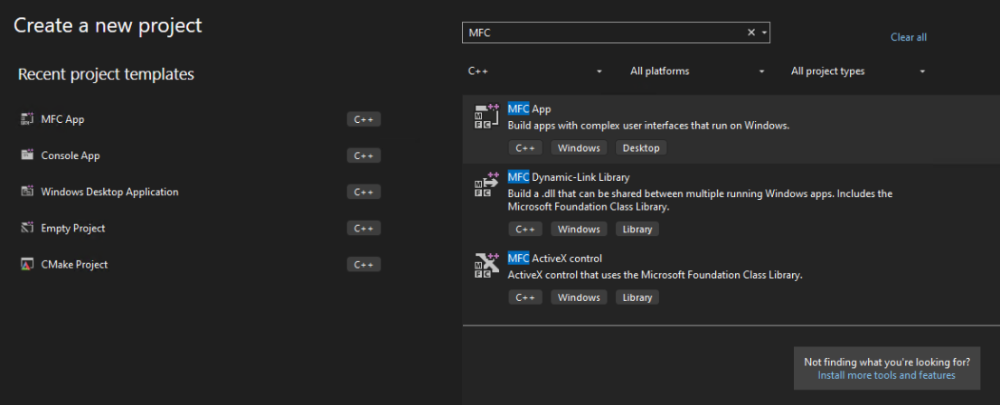
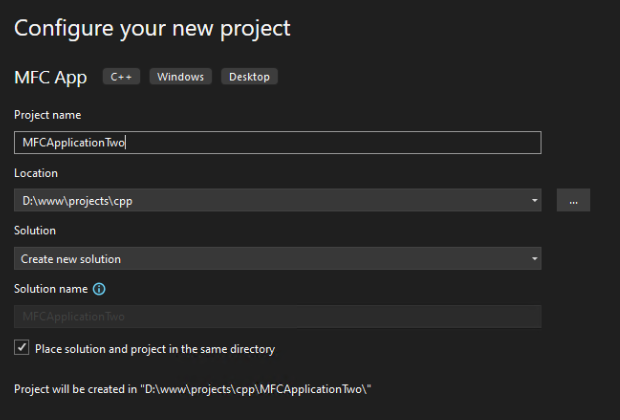
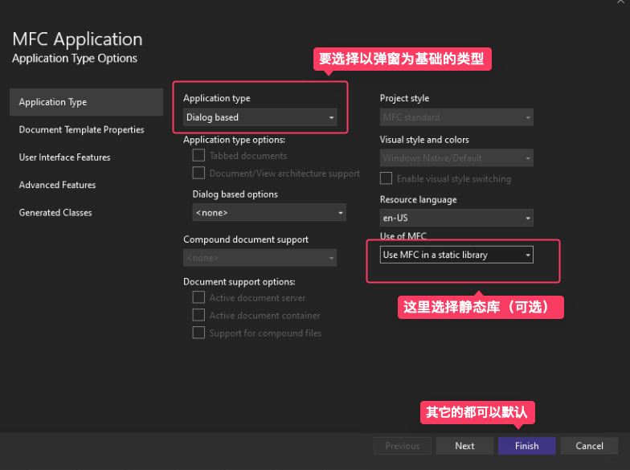
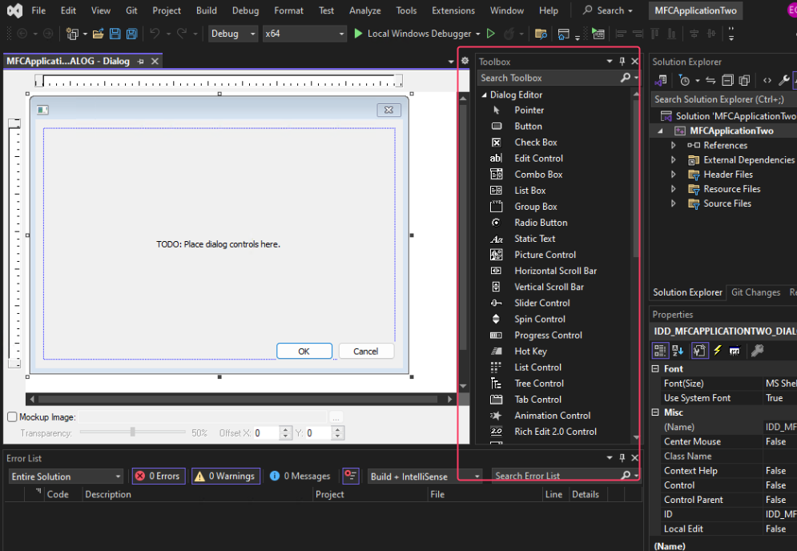
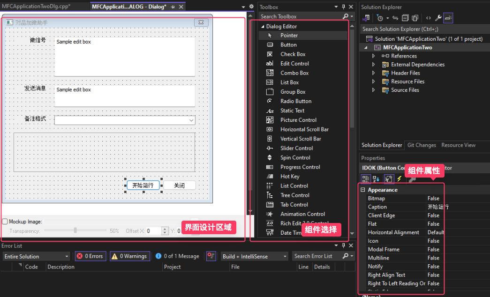
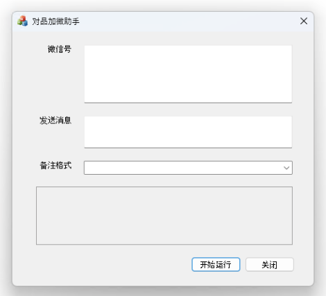
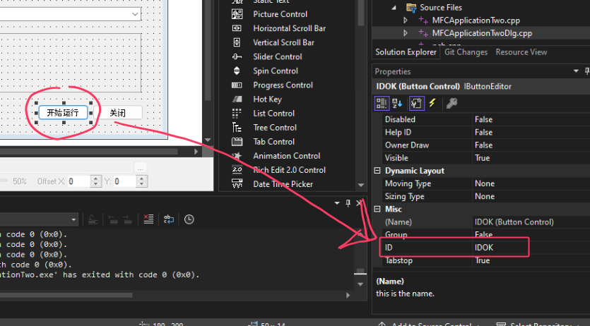

# 使用 Visual Studo + MFC 开发一个简单的桌面应用

打开Visual Studo

选择创建 MFC App（如果没有这个选择就添加下支持）

配置下项目

MFC 应用选项

可以通过工具栏来选择组件，来设置自己的窗口

设计自己的界面

现在就可以点击运行来查看下界面效果

看起来已经像那么回事了

现在就要开始写逻辑了，可以先去界面设计里面把需要关联的组件ID都更改一下，方便待会关联：

