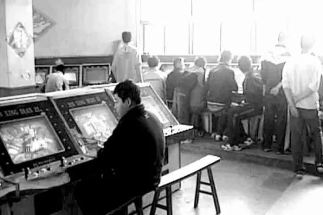
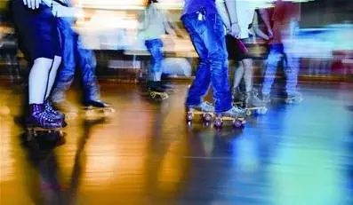
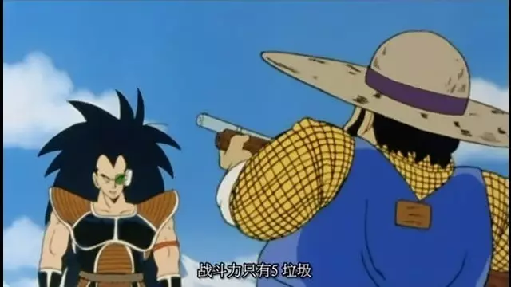
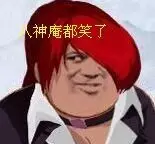
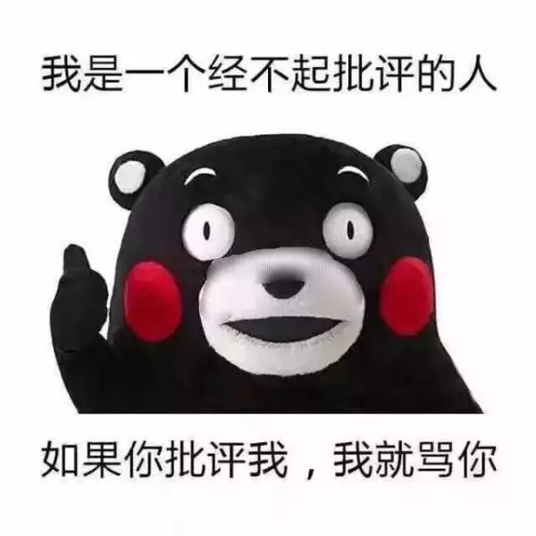
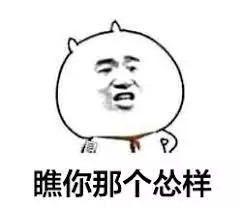
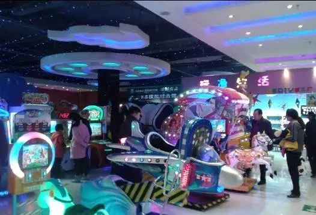

# 街机回忆，我们这一代人的街机厅岁月

我们这一代人，接触街机应该比电脑游戏更早

在我小时候，朋友之间交流可以不知道【拳皇】里的草薙京的薙怎么念，但是你不能不知道八神庵的必杀该怎么放；

你可以不知道【三国战记】里武将们的故事背景，但是你不能不知道他们可以拿什么特殊物品；

你可以不知道【合金弹头】角/色们的名字，但是你不能不知道其中各种弹药的作用；

你可以不知道【忍者棒球】里的四个主角的动作很多来源于棒球比赛中的实际技巧，但是你不能不知道他们怎么打 Boss……

我的家乡是浙江中部的一个小县城，是一个从城南到城北只需要走半小时的地方。我外婆家就住在城北，往外走几步就是县城最大的人民广场，穿过广场就是县城的**“大街”**，而那个令家长们深恶痛绝的街机厅就在大街的另一侧的一个小胡同的拐角处

每次掀开门帘，那股二手烟和不知名气体的混合气味就会经由我的呼吸直冲脑门，令人不由得精神大振

在那一刹那感觉自己仿佛游戏之神附体，什么游戏都可以一命通关！掏钱买游戏币，找空机器坐下，投币选人，摇杆按键一气呵成。。。。

最终在坚持三分钟后被机器消灭，随着身体的一阵。。。哦不是，是随着屏幕上出现的 **GAME OVER**，一切变得索然无味

街机是我的童年里绕不开的一个话题，就如同麻将扑克于成年人，生存繁衍于动物，它们或者他们在草原，在林间，在棋牌室搞对抗，我和我的朋友们则在街机厅挥洒着汗水和游戏币

街机厅里一般可以分为三类人，

**玩游戏的**，**看别人玩游戏的**，**进来抓玩游戏的**

碍于游戏天赋或者游戏经验，大部分玩游戏的人都会在 5-10 分钟内结束游戏或者继续投币，如果他选择站起来，那么不出三秒钟，一般在他身后看他玩游戏的人之中就会有人坐下代替他

所以街机厅的里的人都处于一种叠加状态，就如同薛定谔的猫，在他坐下之前你是不知道他是不是想玩游戏的，可以说是非常 Hardcore 了

那时候的街机厅和现在大商场里的游戏区又不太一样。那个时候街机厅没啥规范，再加上还没有网吧可去，迪厅电影院消费又高，技术好一个币能玩一下午的街机厅自然成了大部分社会青年的选择，所以父母一般都不会让自家孩子去那种地方。

**“三室一厅一场”还记得么？**

（游戏室 录像室 台球室 歌舞厅 溜冰场）

但是架不住打一把【拳皇】的诱惑实在是比挖蚯蚓之类的传统娱乐项目大了太多，形成了一种良币驱逐劣币的市场效应，在蚯蚓们庆幸自己逃离魔爪的同时，无数小朋友们纷纷铤而走险，在街机厅的前台掏出了自己辛苦攒下的零花钱

第三类人往往就出现在这种情况，脸色铁青的家长在进入街机厅的瞬间，强大的气场就会让气氛降到冰点，然后在鸦雀无声的人群中迅速找出自己的孩子带回家教育一番，有脾气火爆者甚至当场就会上演一波真人快打

当时我就见过一哥们嘴里喊着“吾射，吾射”（【拳皇】中杀马特鼻祖八神庵的技能空耳)地冲着他爸张牙舞爪，企图 diss 他来展现自己的武力，然而因为武力值差距太大，这场 battle 毫无悬念。

他爸一巴掌把他拍倒在地，然后拎着他回了家。我只能对这位哥们表示遗憾，机智如我是从来不在自家附近的游戏厅出入的，来外婆家也都是等父母回家后才出动

其实吧，父母这么做也是为了孩子好，虽说我们小县城民风淳朴，很少出现街机厅初高中生抢钱之类的事件，但终究是会有倒霉鬼遇到的，没错，那个人就是我。。还有我的好基友 P 哥

说起 P 哥确实是个奇人，游戏天赋超群，我带他一起打街机才没几次就可以在【拳皇】把我轻松 1V3 了（不是我太弱，是 P 哥真的太强了！我说真的！）

强就强吧，关键此人还极壕，事情就发生在一次我们俩去学校边的街机厅的时候。

那天 P 哥在众人震惊的目光中朝门口老板的桌子上拍下一张一百元的人民币（那时候的一百元对孩子来说还是挺多的）。。。。。然后买了五元的游戏币分了一半给我

P 哥的解释是身上没有零钱，好在我们也算是常客，老板自然没有质疑这钱的来路。就在我和 P 哥打算找个空机器切磋一盘的时候，我俩边上站了三四个初中生模样的人，拍了拍我们的肩膀喊我们去门口**“说个事”**。

我和 P 哥对视一眼，这次算是遭了重了，不说我俩都还只是小学生，不巧的我俩战斗力都很渣，个子又小。尽管十分不情愿，我们还是在他们的注视下走了出去。

他们带头的那位直截了当地说了类似“小孩子挺有钱啊，不想被打就把钱拿出来”之类的小流氓经典台词，当时我和 P 哥也是头一回遭遇这种事情，两个人都怂了，当 P 哥正要把钱掏出来给他们的时候，剧情的转折出现了。原来老板一直在门后暗中观察，看到这情况冲出来照着带头小哥的脑袋就是一巴掌，随之而来的还有一连串方言脏话，一套军体拳 combo 打得他们几个人抱头鼠窜，这一套连招简直比【拳皇】里的人物招式精彩太多了。。。。

故事结局就是我和 P 哥之后被老板喊回到街机厅里去玩，但是我俩心神不宁，玩了一会儿就各回各家了，而且谁也不敢和父母提起这件事情，**因为父母的注意力肯定会集中在我俩去街机厅这个事情上**

相较于我和 P 哥和地下活动一样去街机厅，对于现在的小孩子来说，和父母去商场顺便去游戏区玩一玩街机是再正常不过的事情，游戏种类也是多种多样，益智游戏，团队游戏层出不穷。

和现在的商场游戏区不一样的是，虽然主体都是各种街机游戏，但是街机厅的感觉是完全不一样的，有一股属于那个年代的颓废感。我小时候根本还没有时尚啊流行的概念，那时候的年轻人心目中，不修边幅就是酷。以前街机厅里的年轻人大多梳个中分头，穿个喇叭裤和拖鞋，嘴里叼着根烟，坐在游戏机前吞云吐雾，手上的操作却一刻未停。

这些人恰恰都是老师家长口中“坏学生”的典范，而烟雾缭绕中的他们，就是那个时代叛逆精神的具体表现。但是在我眼中，他们玩游戏时的专注神情和精彩操作是真的挺酷的（抢钱未遂那哥们不算）
