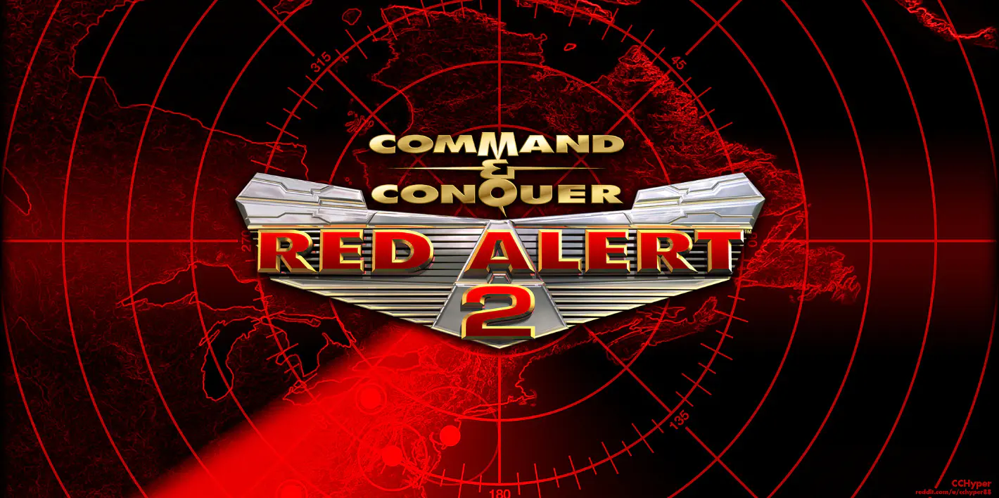
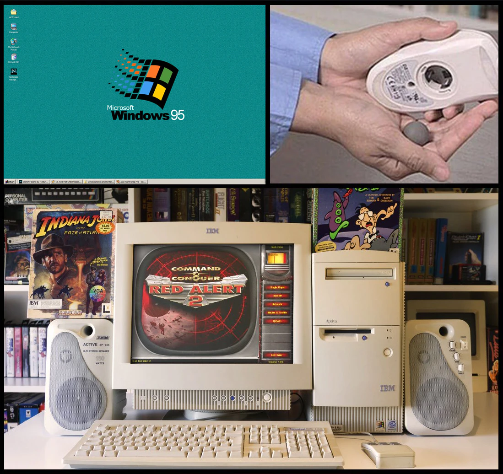
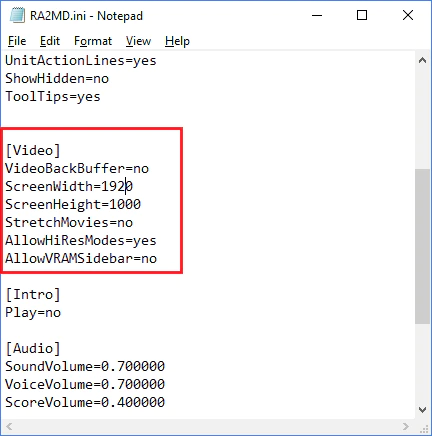
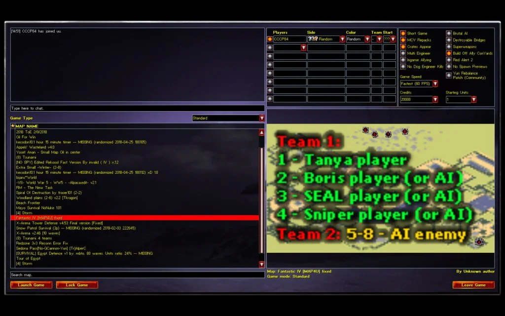
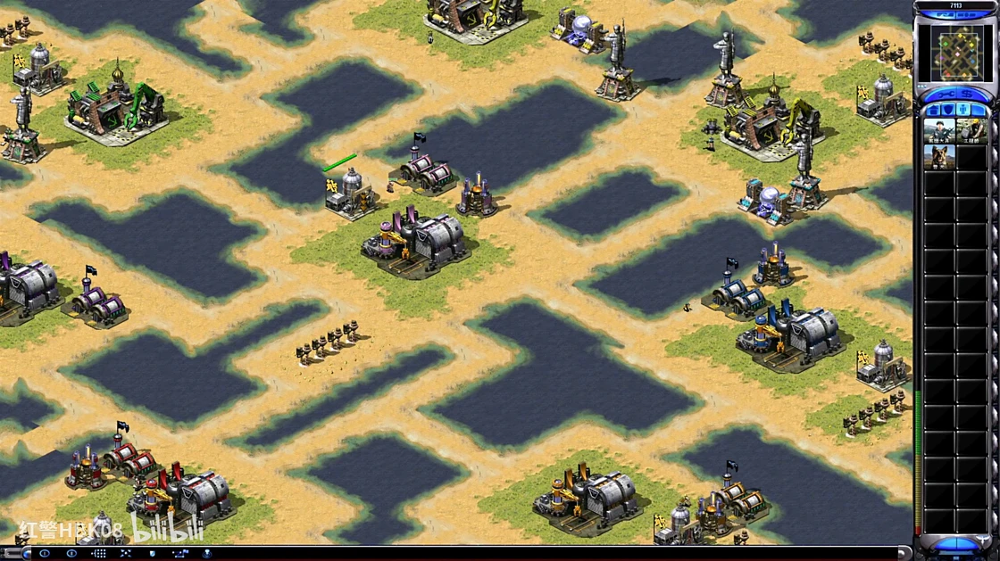
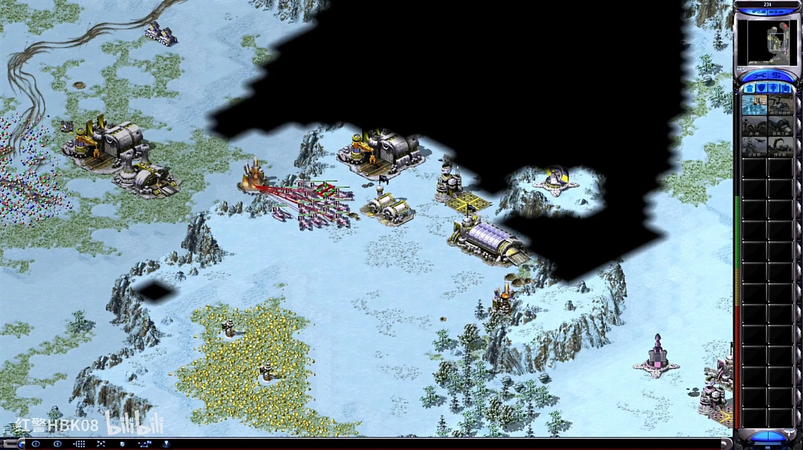
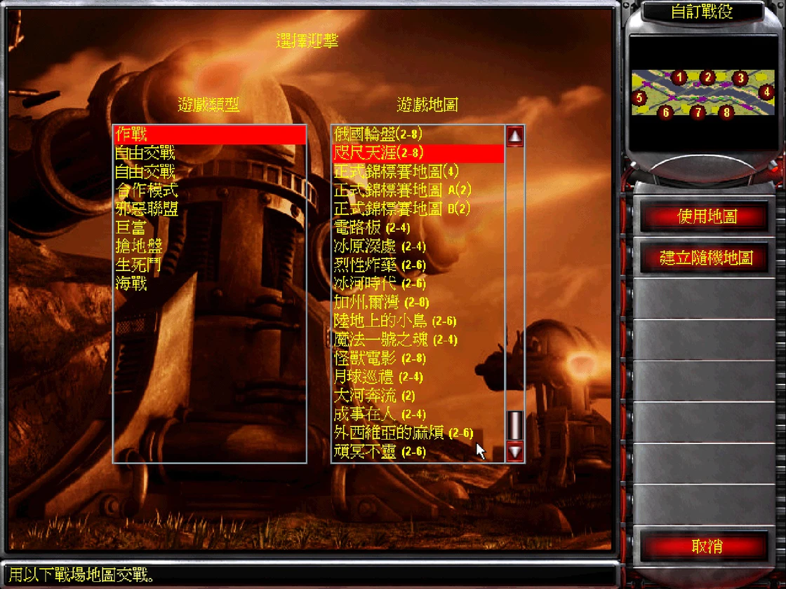
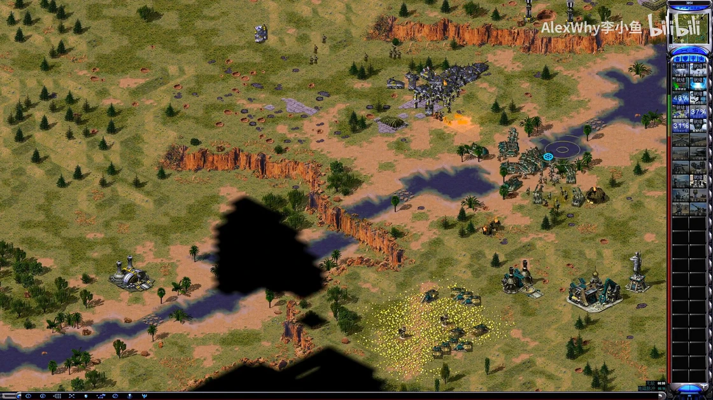
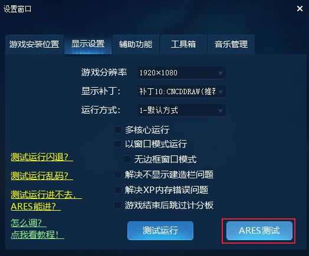

# 《命令与征服：红色警戒 2 与尤里的复仇》发展现状及我的思考

对于很多 80 后和 90 后来说，20 世纪 90 年代和世纪之交的那十几年总是令人心生神往。不论是音乐、影视剧还是流行文化都呈现出别样的朝气和多元性。

那段时间的 PC 电子游戏工业也是如此，尤其是在世纪之交的那几年。强大的 3D 图形 API 和更棒的硬件设备都开始出现在了品类丰富的 PC 市场，Windows 操作系统随着个人电脑硬件价格不断降低带来的高触达性也在几年间占据了极客和都市白领们的视野。这就意味着，更好的硬件性能和统一的软件开发平台为 PC 游戏的发展提供了诸多便利，游戏开发者们诸多不切实际的想法逐渐可以通过现有的软硬件来实现。PC 也在那时起，开始在由家用游戏机占据的电子游戏市场开拓出新天地。

作为在 1992 年才正式被定义的游戏类型，即时战略游戏（Real-Time Strategy games，以下简称 RTS）在创始者 Westwood Studios（以下简称 Westwood）和追赶者暴雪、 Ensemble Studios 等著名开发商的推动下正朝着最辉煌的时代持续前进。从今天回顾过往，在那个 RTS 日新月异的年代，Westwood 于 2000 年发售的《命令与征服：红色警戒 2》（Command & Conquer Red Alert 2，以下简称「红警 2」）不过是竞争激烈的 RTS 市场中的姣姣者之一。

红警 2 是我接触的第二批电脑游戏，更早一点的游戏有《三角洲特种部队》（Delta Force）等。在 2000 年代早期，个人电脑还是个稀罕玩意，更多是在厂矿单位或者跨国企业的办公室里见到。一部分 80 后和 70 后厂矿员工的工作包含了「使用电脑」和「出差」这两项活动，这就为电脑游戏在办公室内外的传播提供了窗口；一部分家长因为工作和接送时间冲突，往往会先将放学的子女带到单位，等下班之后再一起回家。

我相信有相当一部分 90 后要么是在这个时候开启了电脑游戏和主机游戏的「启蒙时代」，要么就是借助包机房和网吧在全国各地快速兴起开始接触到这些 RTS。不论如何，在 RTS 黄金时代接触过这些游戏的玩家，无论精通与否，都会对这一类型有着别样的情感。

重温经典。图片来源：X@gamechuckretro

从当今的视角来看，不管其母 IP《命令与征服》（以下简称 CNC）还是红警 2，在 RTS 社群中的热度和地位，都远不及对全世界游戏行业甚至商业都造成重大影响的《星际争霸》（StarCraft）系列和持续维持社群热度并辛勤更新至今的《帝国时代》（Age of Empires）系列。

但即便如此，红警 2 仍然凭借着其几乎不可复制的魅力和时代特色收获了五洲四海的大量玩家，而民间的热情更使得红警 2 的玩家群体持续活跃至今。

## 软硬件要求和解决方案

仅从理论上看，几乎任何一台 2000 年之后生产的电脑都可以完美运行红警 2 和其资料片《尤里的复仇》（Yuri's Revenge，以下简称「尤复」），但事实上并非如此。

仅在硬件上提供足够的性能是不够的。由于这部作品年代久远，并且 Windows 系统在不断更新的过程中也会抛弃一些老旧的 3D 图形功能。如果直接将老游戏安装在新系统上，游玩时就会出现卡顿、黑屏甚至崩溃的问题。所以想要在新系统上流畅运行红警 2，就需要额外的功能打包文件。

由于 CNC 的渲染基于微软的 DirectDraw 库，民间爱好者组织为了在更新的 Windows 系统上流畅运行，就会在 DirectDraw 的相关功能上做文章。社区中比较著名的包括 CnCNet 的 ts-ddraw 和 FunkyFr3sh 的 CNC-ddraw 都能够很好地解决各种问题，也增加了不少功能，方便玩家调整分辨率等参数。

随着 EA 在 EA App 和 Steam 上重新发布了这款游戏，正版玩家基本上可以做到无需任何补丁就能畅玩，但分辨率仍然需要进入游戏目录手动设置。正版的红警 2 和尤复都没有采用最全能的 ddraw 补丁库，而是采用了一个运行效率较慢、功能单一但是更稳定的 ddraw 库。可能对于这 20 多年一直在玩红警 2 的老鸟来说，修改分辨率已经成为了熟练操作，但对于刚刚接触这些老游戏的玩家而言，还是需要按照网上的教程来学习一下如何设置分辨率。

利用红警 2 文件目录中的 .ini 文件修改分辨率。图片来源：wiretuts.com

红警 2 这样的老游戏不仅在软件兼容性上有着各种各样的毛病，在硬件调度上也有问题：它只能调用 CPU 的一颗逻辑核心。对电脑硬件稍有了解的读者应该清楚，现在的电脑 CPU 都是多核心处理器，但在 25 年前，距离第一颗消费级多核心 CPU 的诞生还差 5 年，因此在当时的电脑游戏开发中，根本就没人想过为所谓的「多核心/多线程 CPU」进行设计和优化。所以在红警 2 中，当玩家生产了足够多的单位时就会出现可怕的卡顿现象，就是因为游戏对于单个核心的超量占用造成的。

玩家们的热忱是解决这些问题的灵丹妙药。现在我们可以在网上找到各种各样解决红警 2 卡顿的方法，包括修改「.ini」文件或者利用 Windows 任务管理器直接让游戏调用多个核心。红警 2 足够好玩，玩家们的热情也一直都在，任何兼容性和性能问题都不是问题。

此外，包括调整战役运行速度、遭遇战模式下解锁所有多人对战模式等各种功能，玩家们都已经在互联网上给出了完善的解决方案。

## 联机对战平台

这种热忱自然也延伸到了红警 2 的联机对战领域。

在游戏的生命周期内，红警 2 采用了 gamespy 提供的网络进行连接，因此，随着 gamespy 的关闭，正版红警 2 已完全不可联网。这当然难不倒玩家们。

全球范围最流行的对战平台当属 CnCNet，不少红警 2 对战高手都会在这里互相切磋。CnCNet 提供了完善的游戏历史、数据记录、部分 mod（尤其是心灵终结）的高兼容性、反作弊和天梯排名系统，还为不同区域的玩家提供了高速服务器，保证稳定顺畅的联机体验。想要跟全球红警 2 玩家一较高下，CnCNet 是最佳选择。

CnCNet 对战选项选择界面。图片来源：forums.cncnet.org

在中国大陆，目前在玩家群体中比较知名的有「红警 2 战网」和「兰博玩电竞」这两大平台。这些平台不仅拥有 CnCNet 的全部功能，并且形成了一套符合自身情况的订阅付费模式。不论是红警 2 战网还是兰博玩电竞，会员收费的主要目的是用于维护庞大的服务器开销，同时利用会员门槛提供更多社群化体验。红警 2 战网依赖玩家自制地图使用的门槛吸引用户付费，而兰博玩电竞则是限制免费用户创建房间的次数。

中国大陆玩家使用国内的对战平台的优势自然是语言友好和更稳定的对战体验，这些平台也对游戏的部署和运行进行了整合，提升了对电脑软硬件不熟悉的玩家的友好度。此外，在战网上提供的社群自制地图确实需要第三方工具才能稳定运行，而国内的战网平台都直接集成了 Ares 组件，方便玩家快速上手游玩这些地图。

国内的联机平台在某种程度上还促成了红警 2 创作者社群的壮大。以「红警 HBK08」「红警月亮 3」等顶级红警 2 玩家为首的创作者在各种视频平台上贡献了千万级的播放量和无数场精彩对局，为喜欢红警 2 的玩家带来了无数的欢乐时光和社区迷因。

## 画面、音乐、战役

和大多数伪 3D 画面的 RTS 游戏一样，红警 2 的画面有时候显得清爽锐利，但有时候又让人感觉眼花缭乱。游戏中多数地形和单位棱角分明，阴影错落有致，大多数颜色倾向于以高饱和度呈现，这就让游戏在静态画面下有相当的秩序感；但一旦画面移动起来，或者画面中的单位太多太杂，以及在和敌方单位交火的时候，画面极易显得杂乱无章。这在 2000 年代左右的低分辨率显示器上不会有太大问题，但是在当今 1080P、2K 甚至 4K 分辨率下可能会让部分玩家感受到些许不适。

游戏的音乐绝对是红警 2 和尤复的亮点，过耳不忘。即便是不怎么玩电脑游戏的音乐人都听过《Hell March》也知晓 Frank Klepacki 的大名。他自己也开创了一个电子摇滚流派「Rocktronic」，利用工业风和电子乐为 CNC 系列中的诸多作品配乐。

Frank Klepacki。图片来源：frankklepacki.com

不过，对于部分中国玩家来说，在他们早期游玩红警 2 的经历中并没有关于游戏音乐的记忆，也不知道红警 2 和尤复还有单人战役过场动画，但这两大元素曾经的确是 Westwood 提供优秀 RTS 的招牌的重要组成部分。

这可能和 2000 年代初的存储介质有关。尽管 DVD 的价格当时正在逐年下探，但 CD 光盘在市场上仍有相当的存量和需求，且具备相当的成本优势。彼时，一张 CD 的最大容量在 900MB 左右，而集成了尤复的完整版红警 2 游戏体积高达 2GB。对于尚未广泛接触电脑游戏的中国大陆数字娱乐市场而言，音乐和过场电影或许是对游戏体验影响最小的一部分，因此当时在坊间流通的一部分盗版红警 2 游戏 CD 中，过场动画和音乐几乎都是缺失的（而后 DVD 版本的盗版红警 2 保留了全部的过场电影和音乐）。随着时间的推移，红警 2 的完整游戏文件、过场动画和音乐都已经成为了互联网数据流中不可或缺的组成部分，每个人都能在各个平台上看到、听到。

红警 2 和尤复的单人剧情充满戏谑又不失严肃，属于典型的冷战后风格，但相比同类作品更加诙谐。游戏通过架空历史讲述了一个完全不同的世界大战故事，还颠覆了前作《命令与征服：红色警戒》（Command & Conquer Red Alert）中的部分背景设定。红警 2 和尤复的单人战役关卡设计合理，玩法具备一定的多样性，并且仅从体验上来说，在 CNC 历代游戏中确实是相对比较简单的，通关时间也不像其他 RTS 那么长。玩家一旦抓住窍门或速通捷径，六小时左右通关从红警 2 到尤复的所有战役关卡都不是问题。

## **机制和操作**

红警 2 的基本机制与所有 RTS 作品一脉相承，都是通过建造关键建筑获取资源、攀升科技、构筑防御工事和战斗单位，使用游戏提供的各种方式探索地形并制定战术，最终击败对手。不过相比 CNC 的前作，Westwood 在细节上做到了相当多的改进和创新。

首先，与 Westwood 过往的 CNC 游戏和《沙丘》（Dune）系列只有两列生产窗口不同的是，红警 2 重新设计了建筑和单位的生产序列窗口，定下了经典的「常规建筑」、「战术建筑」、「步兵单位」和「装甲单位」四大生产页面。这一改动虽然增加了一级操作，但这实际上这不仅直接解决了玩家在两列生产栏中迷失自我的问题，更是对玩家利用微操作快速构建生产序列起到了非常积极的作用。比如在利用工程师占领敌方建筑物后快速部署机枪碉堡或哨戒炮打击对手的战术，就能够经常在网络上各种对局视频中见到。

经典混战图「每人一小块地」。注意看，右上角的淡淡色被小黄的快速延伸一波带走。图片来源：bilibili@红警 HBK08

其次，红警 2 和尤复强化了不同单位的特性，利用不同阵营的数值差异和特色兵种呈现了更全面的差异感。 Westwood 在红警 1 中为不同阵营设计的建筑和单位套用了相同的风格，但通过不同类型的单位和国家数值加成来体现差异；而在红警 2 和尤复中，Westwood 为盟军、苏军和尤里阵营设计了各具特色的建筑和单位外观，并基于宏观的阵营层面体现数值差异。盟军在第三级科技的单位的多样性和战斗能力上有着相当的优势，但缺点是装甲较弱；苏军战斗单位的生命值明显比盟军高出不少，但第三级科技明显疲软，因此想要玩好苏军，更多就是依赖快攻，或者海量犀牛坦克组成的装甲大军迅速摧垮对手；尤里阵营依赖心灵科技和质量中庸的特色单位，虽然兵种类型有限，但非常强势。

最后，重新设计的单位模型大小和比例也为操作提供了更高的上限。Westwood 似乎是受到了《星际争霸》的启发，在红警 2 中对不同单位进行了相对显眼的设计和不同比例的缩放，这就让玩家能更轻易地看到自己想要选择的单位并进行指挥。这种设计带来了一个意想不到的结果是，这种单位缩放比例即便是放在 1080P 分辨率甚至 2K 分辨率下，即便所有的操作压力集中在「选定」和「指定路线」的左键上，熟练的玩家依旧能够精确指挥每一个单位，打出漂亮的微操。

## **技战术和对战玩法**

几乎所有 RTS 都具备一定的操作深度，随之而来的就是更高的竞技上限。

由于资源设置以及单位数量和特性的限制，红警 2 和尤复的竞技上限相比暴雪系 RTS 有所差距，但依然保持了不低的水平。

从大致上看，红警 2 和尤复的逻辑依旧是运营、意识、地图理解、多线和操作这五大要素，只不过由于游戏设计的关系，红警 2 和尤复的常规战斗更加抽象化，更加大开大合，甚至在战术执行层面还保留了一点点容错率——比如利用工程师占领对手兵营或电厂以获取前期发展优势而不成时，玩家可以快速改变战术，转为正常发展，并停产部分单位以在经济层面重新追赶。

基地拉中、利用高低差优势打击对手或防守，「冰天混战」集合了红警 2 所有战术要点。图片来源：bilibili@红警 HBK08

我根据自己的游戏和观战体验，在主观上认为红警 2 和尤复相比其他 RTS 更注重对地图的理解，很多玩法都是以地图为准的，比如经典的「冰天混战」，就是在「冰天雪地」这张官方地图进行的 8 人混战地图。这个玩法一般还会开启官方的「生死斗」模式和随机工具箱。

「生死斗」模式完全禁止第三和第四等级科技，所有阵营只能生产少部分第二等级科技的单位和阵营特色单位，更不能生产「移动基地车」，这就意味着这种模式迫使玩家打上一场你死我活的坦克大战。而「冰天雪地」这张地图涵盖了近、中、远三种玩家间距，经济热点，高低差和建筑学，将红警 2 和尤复几乎全部技战术要点都总结在了这一张地图之中。另外，不仅是混战模式，许许多多精彩的单挑对局也都来自「冰天雪地」。所以想要成为「真正的红警 2 高手」，玩好这张地图是必经之路。

利用 .ini 文件在 Steam 正版游戏中解锁仅能在多人对战中才能游玩的官方模式。图片来源：作者本人游戏截图

另一条红警 2 高手的必经之路，同样是让红警 2 社区在 2020 年代重新焕发生机的的地图，就是经典的「每人一小块陆地」，简称「小块地」。小块地同样也是一张适合混战的地图，来自网友自制，非常考验玩家的操作精度和速度，以及进攻意识。

小块地的开局淘汰率非常之高，仅仅是在开局时展开基地车的速度比其他对手慢一拍，就有可能在一两分钟内被邻居带走。当玩家撑过开局阶段之后，面临的就是有限的建造空间和经济来源。小块地的资源十分有限，每个玩家基地附近只有一点金矿（有矿版）或仅有一幢科技炼油井（无矿版），所以争夺对手的资源也成为了这张地图的必要策略之一。玩家完全可以龟缩在自己的一小块地之中慢慢发展，但速度肯定比不上占据了更多资源并持续扩张的玩家。并且这张图也有足够的水域供玩家操作海军，如果玩家实力足够强劲，就有可能发展出相当规模的海上力量，与对手一决雌雄。

当然，标准的比赛地图会为双方选手提供标准且对等的资源配置和进攻路线，这考验的就是玩家们的基本功了。

## 社群创作

在官方运营缺位的前提下，红警 2 和尤复依旧具备生命力和广泛的玩家群体，离不开第三方对战平台、玩家贡献的兼容性工具包、自制地图和各种 mod 的不断涌现。尽管 Westwood 发布的游戏只有红警 2 和尤复，各种各样国内外玩家的自制 mod 也是红警 2 大社群不可或缺的组成部分。

目前，国内外最知名的红警 2 mod 当属《心灵终结》（Mental Omega，简称 MO），它将红警 2 抬升到了全新高度。MO 以尤复的背景为蓝本重新编写了剧情故事，并设计了极具挑战性的 132 个单人和合作战役，数量之大前所未有；MO 也对尤复的不同阵营进行了重新诠释，为三大阵营设计了全新的建筑、单位和子阵营及其特色兵种和能力，让游戏更具战术深度。

从观战体验上来看，MO 的对战依赖多兵种配合和阵营特殊能力，而非红警 2 和尤复的广泛依赖数量优势取胜，因此在观感上更像《星际争霸》而非原始的红警 2 和尤复。

《心灵终结》的 PVP 对战需要用上各阵营的优势资源，因此观感上更像星际争霸。图片来源：bilibili@AlexWhy 李小鱼

而更早一辈的国内老玩家，在他们心中留下深刻印象的必然是《兵临城下》《共和国之辉》《中国崛起》和《赤龙之吼》这些 mod，而在这其中，影响最广的就是《共和国之辉》（以下简称「共辉」）。不过由于这款 mod 在设计和体验上只能说勉勉强强令社区核心玩家满意，因此在 CNC 和红警 2 社区玩家经年累月的拨乱反正之后，最终褪去了曾经的光环。但由于其曾经巨大的影响力，国内的战网平台依旧保留了「共辉模式」和之后更新的「共辉 2 模式」，便于加载基于共辉的 mod、地图，和对共辉有感情的玩家畅玩。

除了 mod，玩家自制的特色地图也是红警 2 社区不可缺失的重要组成部分。随着 FinalAlert2 编辑器和 Ares 组件的逐渐普及，各种别出心裁的特色玩法都可以实现。除了小块地这种经典的玩家自制地图之外，各种各样的单人或合作任务、防守玩法、不公平对战等地图都是娱乐玩家们在战网上的首选。这些地图依靠作者在地图上设计的各种加成和增益，虽然整体框架并没有超出红警 2 和尤复的范畴，但这些自制地图还是为玩家提供了超越红警 2 和尤复基础玩法的别样体验。

需要注意的是，有不少玩家自制地图需要 Ares 组件，而正版的红警 2 和尤复都没有这个组件，因此想要流畅游玩这些模式，玩家还是需要自己动手安装它，如果嫌麻烦或者有联机需求的话，第三方战网平台仍是最优选择。

红警 2 战网的安装程序集成了 Ares 工具，玩家可以直接测试，测试成功后即可畅玩各种模式和特色地图。图片来源：作者个人战网截图

除了老生常谈的 mod 和玩家社区，在 2020 年代，一款游戏持续火热的重要助推剂就是内容创作者生态。依赖民间的红警 2 赛事和玩家整活诞生的红警 2 创作者群体是不少视频平台流量的重要来源，相当数量的网友也在持续观看各种类型的红警 2 内容。

「游戏一局不玩，视频一期不落」是不少红警 2 观众的「座右铭」，这虽然在某种程度上体现了玩家和观众的兴趣差异，但从另一个侧面体现了红警 2 创作者的强大吸引力。

## 感慨

作为陪伴了我自己和网友们 20 余年的经典 RTS，红警 2 不仅仅是一个现象，更是形成了一个经久不衰的玩家社区和自成一派的游戏文化。这个系列没有游戏内工会、没有聊天系统、没有内购，也没有多少 DLC 和实质性的更新，但就是因为这款游戏配置要求够低，上手简单，也足够好玩，配合极佳的 mod 生态，让数量庞大的电脑使用者变成了红警 2 玩家，变成了红警 2 的地图制作者，变成了红警 2 的内容创作者，变成了红警 2 观众，变成了红警 2 民间比赛的热门选手甚至登上领奖台。

在这其中的一些玩家还见证了 RTS 这一主要 PC 游戏类型的兴衰，见证了曾经的主流逐渐被 FPS 和 MOBA 取代，也见证了这一类型的顽强生命力。我十分相信，每个玩家看着伴随着自己童年和青年生活的游戏和游戏类型仍旧枝繁叶茂时，总有一种溢于言表的亲切感萦绕心间，并在不时捡起把玩的过程中，还能感受到历久弥新的兴奋和快乐。

_（封面来源：CCHyper）_
